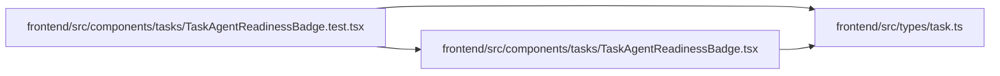

# TaskAgentReadinessBadge.test Module

**Path:** `frontend/src/components/tasks/TaskAgentReadinessBadge.test.tsx`

## Description

_Auto-generated from `frontend/src/components/tasks/TaskAgentReadinessBadge.test.tsx`._

## Imports

| Source | Symbols | Type-only | Runtime emission |
|--------|---------|-----------|------------------|
| `../../types/task` | `TaskAgentReadiness` | Declaration | erased |
| `./TaskAgentReadinessBadge` | `TaskAgentReadinessBadge` | — | compiler-dependent |
| `@testing-library/react` | `render`, `screen` | — | compiler-dependent |
| `@testing-library/user-event` | `userEvent` | — | compiler-dependent |
| `react-router-dom` | `MemoryRouter` | — | compiler-dependent |
| `vitest` | `describe`, `expect`, `it` | — | compiler-dependent |

## Module Signals

| Signal | Values |
|--------|--------|
| Constants | `readiness` |
| Module calls | `describe` |

## Local dependency map

<!-- Auto-generated local dependency summary. Do not edit by hand. -->
This graph shows full source coupling. Type dependencies can be erased; compiler-dependent cycle groups are runtime candidates, not confirmed initialization cycles.

```mermaid
flowchart LR
    n0["frontend/src/components/tasks/TaskAgentReadinessBadge.test.tsx"]
    n1["frontend/src/components/tasks/TaskAgentReadinessBadge.tsx"]
    n2["frontend/src/types/task.ts"]
    n0 --> n1
    n0 --> n2
    n1 --> n2
    click n0 "../modules/TaskAgentReadinessBadge.test.md"
    click n1 "../modules/TaskAgentReadinessBadge.md"
    click n2 "../modules/types_task.md"
```

### Internal neighbors

| Direction | Module |
|---|---|
| Outbound | [TaskAgentReadinessBadge](../modules/TaskAgentReadinessBadge.md) |
| Outbound | [types_task](../modules/types_task.md) |

### External packages

| Language | Used packages | Undeclared packages |
|---|---:|---:|
| typescript | 4 | 0 |
