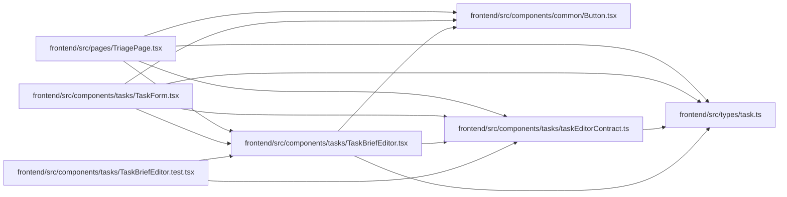

# TaskBriefEditor Module

**Path:** `frontend/src/components/tasks/TaskBriefEditor.tsx`

## Description

_Auto-generated from `frontend/src/components/tasks/TaskBriefEditor.tsx`._

## Imports

| Source | Symbols |
|--------|---------|
| `../../types/task` | `TaskBrief` |
| `../common/Button` | `Button` |
| `./taskEditorContract` | `newCriterion` |
| `lucide-react` | `ArrowDown`, `ArrowUp`, `Plus`, `Trash2` |
| `react` | `useId` |
| `react-i18next` | `useTranslation` |

## Module Signals

| Signal | Values |
|--------|--------|
| Exports | `TaskBriefEditor` |

## Local dependency map

<!-- Auto-generated local dependency summary. Do not edit by hand. -->

### Internal neighbors

| Direction | Module |
|---|---|
| Inbound | [TaskBriefEditor.test](../modules/TaskBriefEditor.test.md) |
| Inbound | [TaskForm](../modules/TaskForm.md) |
| Inbound | [TriagePage](../modules/TriagePage.md) |
| Outbound | [Button](../modules/Button.md) |
| Outbound | [taskEditorContract](../modules/taskEditorContract.md) |
| Outbound | [types_task](../modules/types_task.md) |

### External packages

| Language | Used packages | Undeclared packages |
|---|---:|---:|
| typescript | 3 | 0 |

## Functions

| Function | Signature | Decorators | Description |
|----------|-----------|------------|-------------|
| `TaskBriefEditor` | `({ value, onChange, disabled = false, hideContext = false }: {     value: TaskBrief; onChange: (value: TaskBrief) => void; disabled?: boolean; hideContext?: boolean; })` | — | — |
