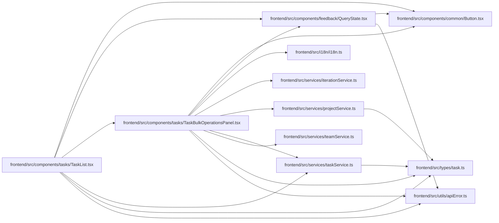

# TaskBulkOperationsPanel Module

**Path:** `frontend/src/components/tasks/TaskBulkOperationsPanel.tsx`

## Description

_Auto-generated from `frontend/src/components/tasks/TaskBulkOperationsPanel.tsx`._

## Imports

| Source | Symbols |
|--------|---------|
| `../../i18n/i18n` | `i18n` |
| `../../services/iterationService` | `iterationService` |
| `../../services/projectService` | `projectService` |
| `../../services/taskService` | `taskService` |
| `../../services/teamService` | `teamService` |
| `../../types/task` | `Task`, `TaskBulkAction`, `TaskBulkOperationRequest`, `TaskBulkOperationResponse`, `TaskBulkOperationResult`, `TaskStatus` |
| `../../utils/apiError` | `getApiErrorMessage` |
| `../common/Button` | `Button` |
| `../feedback/QueryState` | `QueryErrorState`, `QueryLoadingState` |
| `@tanstack/react-query` | `useMutation`, `useQuery`, `useQueryClient` |
| `lucide-react` | `Bot`, `CheckCircle2`, `ClipboardCheck`, `Trash2`, `XCircle` |
| `react` | `useMemo`, `useState` |
| `react-i18next` | `useTranslation` |

## Module Signals

| Signal | Values |
|--------|--------|
| Exports | `TaskBulkOperationsPanel` |
| Constants | `t`, `ACTION_OPTIONS`, `STATUS_OPTIONS` |
| Module calls | `t = bind` |

## Local dependency map

<!-- Auto-generated local dependency summary. Do not edit by hand. -->

### Internal neighbors

| Direction | Module |
|---|---|
| Inbound | [TaskList](../modules/TaskList.md) |
| Outbound | [Button](../modules/Button.md) |
| Outbound | [QueryState](../modules/QueryState.md) |
| Outbound | [i18n](../modules/i18n.md) |
| Outbound | [iterationService](../modules/iterationService.md) |
| Outbound | [projectService](../modules/projectService.md) |
| Outbound | [taskService](../modules/taskService.md) |
| Outbound | [teamService](../modules/teamService.md) |
| Outbound | [types_task](../modules/types_task.md) |
| Outbound | [apiError](../modules/apiError.md) |

### External packages

| Language | Used packages | Undeclared packages |
|---|---:|---:|
| typescript | 4 | 0 |

## Classes

| Class | Kind | Line | Bases / Target | Description |
|-------|------|------|----------------|-------------|
| [TaskBulkOperationsPanelProps](../entities/TaskBulkOperationsPanelProps.md) | Class | 24 | — | — |

## Functions

| Function | Signature | Decorators | Description |
|----------|-----------|------------|-------------|
| `TaskBulkOperationsPanel` | `({     iterationId,     selectedTasks,     selectedTaskIds,     onClearSelection,     onApplied, }: TaskBulkOperationsPanelProps)` | — | — |
