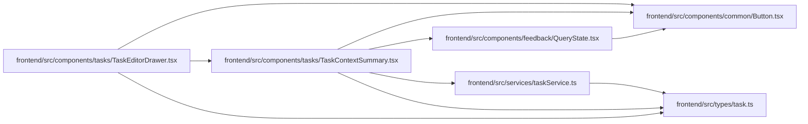

# TaskContextSummary Module

**Path:** `frontend/src/components/tasks/TaskContextSummary.tsx`

## Description

Child and prerequisite pages are independent read projections, keyed by task identity and observed version. Version changes require reloading the owning editor. Failed reads hide cached relationships. Related-task navigation passes through the editor draft guard and uses the canonical task URL parameter. Bounded context never becomes authoritative execution context.

_Auto-generated from `frontend/src/components/tasks/TaskContextSummary.tsx`._

## Imports

| Source | Symbols |
|--------|---------|
| `../../services/taskService` | `taskService` |
| `../../types/task` | `TaskDetail` |
| `../common/Button` | `Button` |
| `../feedback/QueryState` | `QueryErrorState`, `QueryLoadingState` |
| `@tanstack/react-query` | `useQuery` |
| `react` | `useState` |
| `react-i18next` | `useTranslation` |
| `react-router-dom` | `Link` |

## Module Signals

| Signal | Values |
|--------|--------|
| Exports | `TaskContextSummary` |

## Local dependency map

<!-- Auto-generated local dependency summary. Do not edit by hand. -->

### Internal neighbors

| Direction | Module |
|---|---|
| Inbound | [TaskEditorDrawer](../modules/TaskEditorDrawer.md) |
| Outbound | [Button](../modules/Button.md) |
| Outbound | [QueryState](../modules/QueryState.md) |
| Outbound | [taskService](../modules/taskService.md) |
| Outbound | [types_task](../modules/types_task.md) |

### External packages

| Language | Used packages | Undeclared packages |
|---|---:|---:|
| typescript | 4 | 0 |

## Functions

| Function | Signature | Decorators | Description |
|----------|-----------|------------|-------------|
| `TaskContextSummary` | `({ detail, onNavigate, onReload }: { detail: TaskDetail; onNavigate?: (id: number) => void; onReload?: () => void })` | — | — |
