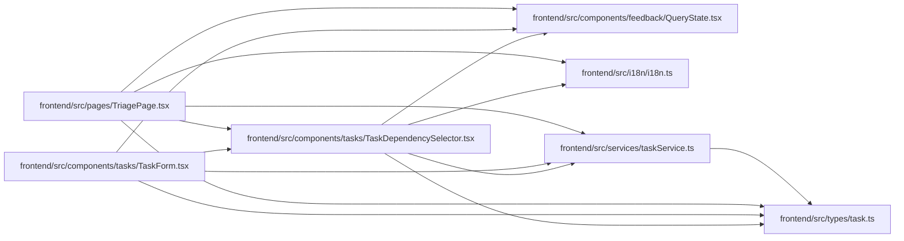

# TaskDependencySelector Module

**Path:** `frontend/src/components/tasks/TaskDependencySelector.tsx`

## Description

_Auto-generated from `frontend/src/components/tasks/TaskDependencySelector.tsx`._

## Imports

| Source | Symbols |
|--------|---------|
| `../../i18n/i18n` | `i18n` |
| `../../services/taskService` | `taskService` |
| `../../types/task` | `Task` |
| `../feedback/QueryState` | `QueryErrorState`, `QueryLoadingState` |
| `@tanstack/react-query` | `useQuery` |

## Module Signals

| Signal | Values |
|--------|--------|
| Exports | `TaskDependencySelector` |
| Constants | `t` |
| Module calls | `t = bind` |

## Local dependency map

<!-- Auto-generated local dependency summary. Do not edit by hand. -->

### Internal neighbors

| Direction | Module |
|---|---|
| Inbound | [TaskForm](../modules/TaskForm.md) |
| Inbound | [TriagePage](../modules/TriagePage.md) |
| Outbound | [QueryState](../modules/QueryState.md) |
| Outbound | [i18n](../modules/i18n.md) |
| Outbound | [taskService](../modules/taskService.md) |
| Outbound | [types_task](../modules/types_task.md) |

### External packages

| Language | Used packages | Undeclared packages |
|---|---:|---:|
| typescript | 1 | 0 |

## Classes

| Class | Kind | Line | Bases / Target | Description |
|-------|------|------|----------------|-------------|
| [TaskDependencySelectorProps](../entities/TaskDependencySelectorProps.md) | Class | 9 | — | — |

## Functions

| Function | Signature | Decorators | Description |
|----------|-----------|------------|-------------|
| `TaskDependencySelector` | `({ iterationId, currentTaskId, selectedIds, onChange }: TaskDependencySelectorProps)` | — | — |
