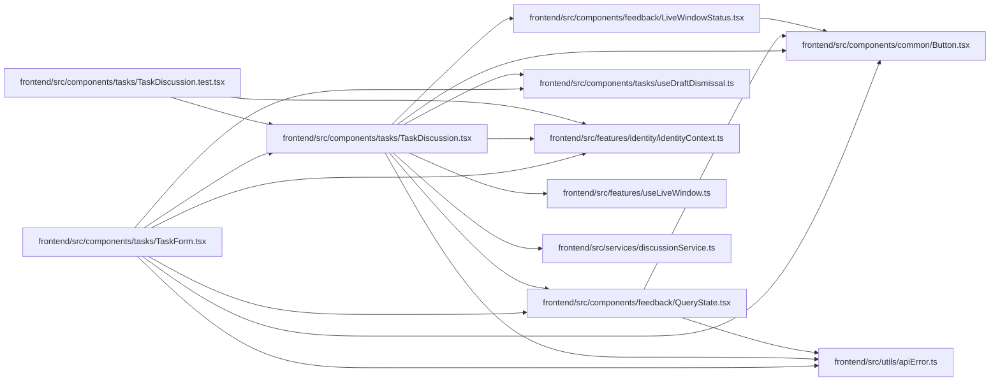

# TaskDiscussion Module

**Path:** `frontend/src/components/tasks/TaskDiscussion.tsx`

## Description

Keeps discussion distinct from execution and acceptance. Plain-text comments preserve authorship, versioned edits and history. Same-account drafts retain edit identity and mentions; conflicts require an explicit current-version comparison. Subscription settings, pending states and errors remain visible without dismissing the task editor.

Comment drafts checkpoint uncertainty before writing and retain input through missing responses. A current read and explicit comparison are required to resume; confirmed version conflicts retain the original edit observation until deliberate reapplication. Operation markers prevent obsolete acknowledgments from clearing newer local input.

## Imports

| Source | Symbols |
|--------|---------|
| `../../components/feedback/LiveWindowStatus` | `LiveWindowStatus` |
| `../../features/identity/identityContext` | `useIdentity` |
| `../../features/useLiveWindow` | `useLiveWindow` |
| `../../services/discussionService` | `discussionService`, `TaskComment` |
| `../../utils/apiError` | `getApiErrorMessage` |
| `../common/Button` | `Button` |
| `../feedback/QueryState` | `QueryErrorState` |
| `./useDraftDismissal` | `useActiveMount` |
| `@tanstack/react-query` | `useInfiniteQuery`, `useMutation`, `useQuery` |
| `react` | `useEffect`, `useId`, `useState` |
| `react-i18next` | `useTranslation` |

## Module Signals

| Signal | Values |
|--------|--------|
| Exports | `TaskDiscussion` |

## Local dependency map

<!-- Auto-generated local dependency summary. Do not edit by hand. -->

### Internal neighbors

| Direction | Module |
|---|---|
| Inbound | [TaskDiscussion.test](../modules/TaskDiscussion.test.md) |
| Inbound | [TaskForm](../modules/TaskForm.md) |
| Outbound | [Button](../modules/Button.md) |
| Outbound | [LiveWindowStatus](../modules/LiveWindowStatus.md) |
| Outbound | [QueryState](../modules/QueryState.md) |
| Outbound | [useDraftDismissal](../modules/useDraftDismissal.md) |
| Outbound | [identityContext](../modules/identityContext.md) |
| Outbound | [useLiveWindow](../modules/useLiveWindow.md) |
| Outbound | [discussionService](../modules/discussionService.md) |
| Outbound | [apiError](../modules/apiError.md) |

### External packages

| Language | Used packages | Undeclared packages |
|---|---:|---:|
| typescript | 3 | 0 |

## Classes

| Class | Kind | Line | Bases / Target | Description |
|-------|------|------|----------------|-------------|
| [EditingComment](../entities/EditingComment.md) | Type alias | 14 | — | — |

## Functions

| Function | Signature | Decorators | Description |
|----------|-----------|------------|-------------|
| `TaskDiscussion` | `({ taskId, draftKey, disabled, onDirty, onPending }: {     taskId: number; draftKey: string \| null; disabled: boolean;     onDirty: (dirty: boolean) => void; onPending: (pending: boolean) => void; })` | — | — |