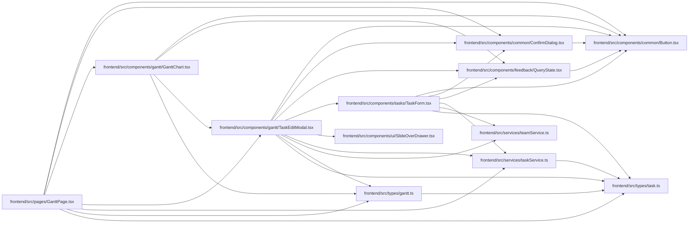

# TaskEditModal Module

**Path:** `frontend/src/components/gantt/TaskEditModal.tsx`

## Description

_Auto-generated from `frontend/src/components/gantt/TaskEditModal.tsx`._

## Imports

| Source | Symbols |
|--------|---------|
| `../../services/taskService` | `taskService` |
| `../../services/teamService` | `teamService` |
| `../../types/gantt` | `GanttTask` |
| `../../types/task` | `Task`, `TaskUpdate` |
| `../common/Button` | `Button` |
| `../common/ConfirmDialog` | `ConfirmDialog` |
| `../feedback/QueryState` | `QueryErrorState` |
| `../tasks/TaskForm` | `TaskForm` |
| `../ui/SlideOverDrawer` | `SlideOverDrawer` |
| `@tanstack/react-query` | `useQuery` |
| `lucide-react` | `Loader2` |
| `react` | `useMemo`, `useState` |
| `react-i18next` | `useTranslation` |

## Module Signals

| Signal | Values |
|--------|--------|
| Exports | `TaskEditModal` |

## Local dependency map

<!-- Auto-generated local dependency summary. Do not edit by hand. -->

### Internal neighbors

| Direction | Module |
|---|---|
| Inbound | [GanttChart](../modules/GanttChart.md) |
| Inbound | [GanttPage](../modules/GanttPage.md) |
| Outbound | [Button](../modules/Button.md) |
| Outbound | [ConfirmDialog](../modules/ConfirmDialog.md) |
| Outbound | [QueryState](../modules/QueryState.md) |
| Outbound | [TaskForm](../modules/TaskForm.md) |
| Outbound | [SlideOverDrawer](../modules/SlideOverDrawer.md) |
| Outbound | [taskService](../modules/taskService.md) |
| Outbound | [teamService](../modules/teamService.md) |
| Outbound | [types_gantt](../modules/types_gantt.md) |
| Outbound | [types_task](../modules/types_task.md) |

### External packages

| Language | Used packages | Undeclared packages |
|---|---:|---:|
| typescript | 4 | 0 |

## Classes

| Class | Kind | Line | Bases / Target | Description |
|-------|------|------|----------------|-------------|
| [TaskEditModalProps](../entities/TaskEditModalProps.md) | Class | 15 | — | — |
| [TaskEditModalContentProps](../entities/TaskEditModalContentProps.md) | Class | 66 | — | — |

## Functions

| Function | Signature | Decorators | Description |
|----------|-----------|------------|-------------|
| `TaskEditModal` | `({     task,     iterationId,     isOpen,     onClose,     sandboxMode = false,     onSaveSandbox, }: TaskEditModalProps)` | — | — |
