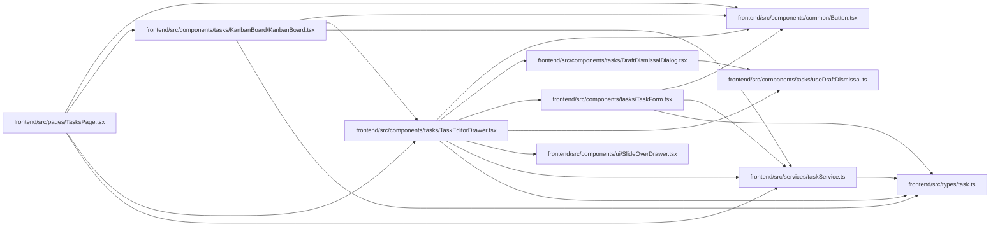

# TaskEditorDrawer Module

**Path:** `frontend/src/components/tasks/TaskEditorDrawer.tsx`

## Description

_Auto-generated from `frontend/src/components/tasks/TaskEditorDrawer.tsx`._

## Imports

| Source | Symbols |
|--------|---------|
| `../../services/taskService` | `taskService` |
| `../../types/task` | `Task`, `TaskUpdate` |
| `../common/Button` | `Button` |
| `../ui/SlideOverDrawer` | `SlideOverDrawer` |
| `./DraftDismissalDialog` | `DraftDismissalDialog` |
| `./TaskForm` | `TaskForm` |
| `./useDraftDismissal` | `useDraftDismissal` |
| `@tanstack/react-query` | `useQuery` |
| `lucide-react` | `Loader2` |
| `react` | `useMemo`, `ReactNode`, `RefObject` |
| `react-i18next` | `useTranslation` |

## Module Signals

| Signal | Values |
|--------|--------|
| Exports | `TaskEditorDrawer` |

## Local dependency map

<!-- Auto-generated local dependency summary. Do not edit by hand. -->

### Internal neighbors

| Direction | Module |
|---|---|
| Inbound | [KanbanBoard](../modules/KanbanBoard.md) |
| Inbound | [TasksPage](../modules/TasksPage.md) |
| Outbound | [Button](../modules/Button.md) |
| Outbound | [DraftDismissalDialog](../modules/DraftDismissalDialog.md) |
| Outbound | [TaskForm](../modules/TaskForm.md) |
| Outbound | [useDraftDismissal](../modules/useDraftDismissal.md) |
| Outbound | [SlideOverDrawer](../modules/SlideOverDrawer.md) |
| Outbound | [taskService](../modules/taskService.md) |
| Outbound | [types_task](../modules/types_task.md) |

### External packages

| Language | Used packages | Undeclared packages |
|---|---:|---:|
| typescript | 4 | 0 |

## Classes

| Class | Kind | Line | Bases / Target | Description |
|-------|------|------|----------------|-------------|
| [DrawerCopy](../entities/DrawerCopy.md) | Type alias | 14 | — | — |

## Functions

| Function | Signature | Decorators | Description |
|----------|-----------|------------|-------------|
| `TaskEditorDrawer` | `({     taskId,     iterationId,     open,     onClose,     mode = 'direct',     prepareTask,     onSaveSandbox,     title,     subtitle,     icon,     beforeForm,     className,     restoreFocusRef, }: {     taskId: number \| null;     iterationId?: number;     open: boolean;     onClose: () => void;     mode?: 'direct' \| 'sandbox';     prepareTask?: (task: Task) => Task;     onSaveSandbox?: (update: TaskUpdate) => void;     title?: DrawerCopy;     subtitle?: DrawerCopy;     icon?: ReactNode;     beforeForm?: ReactNode;     className?: string;     restoreFocusRef?: RefObject<HTMLElement \| null>; })` | — | — |
