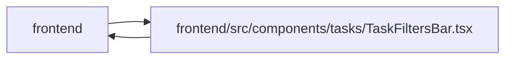

# TaskFiltersBar Module

**Path:** `frontend/src/components/tasks/TaskFiltersBar.tsx`

## Description

_Auto-generated from `frontend/src/components/tasks/TaskFiltersBar.tsx`._

## Imports

| Source | Symbols |
|--------|---------|
| `../../features/planningMasters/planningTaskIssues` | `PlanningTaskIssue` |
| `../../i18n/seedDisplay` | `labelDisplay`, `labelGroupDisplay` |
| `../../services/labelService` | `labelService` |
| `../../services/projectService` | `projectService` |
| `../../services/teamService` | `teamService` |
| `../../utils/taskFilterDefaults` | `defaultFilters` |
| `../common/Button` | `Button` |
| `../feedback/QueryState` | `QueryErrorState`, `QueryLoadingState` |
| `./TaskTextEditorModal` | `TaskTextEditorModal` |
| `@tanstack/react-query` | `useQuery` |
| `lucide-react` | `ChevronDown`, `ChevronRight`, `X`, `FileText`, `XCircle` |
| `react` | `useId`, `useMemo`, `useState` |
| `react-i18next` | `useTranslation` |

## Module Signals

| Signal | Values |
|--------|--------|
| Exports | `TaskFilters`, `TaskFiltersBar` |

## Local dependency map

<!-- Auto-generated local dependency summary. Do not edit by hand. -->

> Module-level dependencies exceed the generated-diagram limits, so the diagram and table below group them by top-level package. Counts report the number of module neighbors in each package.

### Internal neighbors

| Direction | Module |
|---|---|
| Inbound | `frontend` (9) |
| Outbound | `frontend` (9) |

### External packages

| Language | Used packages | Undeclared packages |
|---|---:|---:|
| typescript | 4 | 0 |

> All 17 module neighbor(s) are summarized by package because the module-level view exceeds the 12-node limit.

## Classes

| Class | Kind | Line | Bases / Target | Description |
|-------|------|------|----------------|-------------|
| [TaskFilters](../entities/TaskFilters.md) | Class | 15 | — | — |
| [TaskFiltersBarProps](../entities/TaskFiltersBarProps.md) | Class | 33 | — | — |

## Functions

| Function | Signature | Decorators | Description |
|----------|-----------|------------|-------------|
| `TaskFiltersBar` | `({ iterationId, filters, onFiltersChange }: TaskFiltersBarProps)` | — | — |
