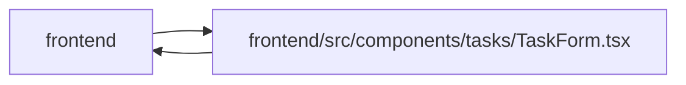

# TaskForm Module

**Path:** `frontend/src/components/tasks/TaskForm.tsx`

## Description

Places title, durable owner, capacity assignment, estimates and commitment state before the canonical brief. AI assistance is an intentional disclosure. The shared editor guards task, work and discussion drafts, preserves conflicts, and separates delivery prerequisites and discussion from current execution evidence.

## Imports

| Source | Symbols |
|--------|---------|
| `../../features/identity/identityContext` | `useIdentity` |
| `../../i18n/seedDisplay` | `templateDisplay` |
| `../../services/iterationService` | `iterationService` |
| `../../services/projectService` | `projectService` |
| `../../services/taskService` | `taskService` |
| `../../services/teamService` | `teamService` |
| `../../services/templateService` | `templateService` |
| `../../services/triageService` | `triageService` |
| `../../types/task` | `GroundedAISuggestionResponse`, `TaskAISuggestRequest`, `TaskCreate`, `Task`, `TaskUpdate` |
| `../../types/template` | `WorkTemplate` |
| `../../types/triage` | `TriageItemCreate` |
| `../../utils/apiError` | `getApiErrorMessage` |
| `../../utils/formatDate` | `formatDate` |
| `../../utils/templateDefaults` | `getPayloadBoolean`, `getPayloadString`, `mergeLabels` |
| `../common/Button` | `Button` |
| `../common/CollapsibleSection` | `CollapsibleSection` |
| `../common/ConfirmDialog` | `ConfirmDialog` |
| `../common/Input` | `Input` |
| `../feedback/QueryState` | `QueryErrorState` |
| `../labels/LabelSelector` | `LabelSelector` |
| `../team/AssigneeRecommendationsPanel` | `AssigneeRecommendationsPanel` |
| `./DeliveryDependencies` | `DeliveryDependencies` |
| `./PersonCapacity` | `PersonCapacity` |
| `./StatusChangeControl` | `StatusChangeControl` |
| `./TaskAgentReadinessBadge` | `TaskAgentReadinessBadge` |
| `./TaskBriefEditor` | `TaskBriefEditor` |
| `./TaskDependencySelector` | `TaskDependencySelector` |
| `./TaskDiscussion` | `TaskDiscussion` |
| `./TaskTimelinePanel` | `TaskTimelinePanel` |
| `./TaskWorkPanel` | `TaskWorkPanel` |
| `./TimeEntriesPanel` | `TimeEntriesPanel` |
| `./taskDraftStorage` | `readTaskDraft`, `writeTaskDraft`, `removeTaskDraft` |
| `./taskEditorContract` | `emptyTaskBrief`, `newCriterion`, `buildTaskEditorDefaults`, `mapTaskEditorServerError`, `toTaskCreate`, `toTaskUpdate`, `validateTaskEditor`, `TaskConflictMetadata`, `TaskEditorValues` |
| `@tanstack/react-query` | `useMutation`, `useQueryClient`, `useQuery` |
| `lucide-react` | `Inbox`, `Save`, `Sparkles` |
| `react` | `useCallback`, `useEffect`, `useId`, `useMemo`, `useState` |
| `react-i18next` | `useTranslation` |

## Module Signals

| Signal | Values |
|--------|--------|
| Exports | `TaskForm` |

## Local dependency map

<!-- Auto-generated local dependency summary. Do not edit by hand. -->

> Module-level dependencies exceed the generated-diagram limits, so the diagram and table below group them by top-level package. Counts report the number of module neighbors in each package.

### Internal neighbors

| Direction | Module |
|---|---|
| Inbound | `frontend` (4) |
| Outbound | `frontend` (33) |

### External packages

| Language | Used packages | Undeclared packages |
|---|---:|---:|
| typescript | 4 | 0 |

> All 37 module neighbor(s) are summarized by package because the module-level view exceeds the 12-node limit.

## Classes

| Class | Kind | Line | Bases / Target | Description |
|-------|------|------|----------------|-------------|
| [TaskFormProps](../entities/TaskFormProps.md) | Class | 53 | — | — |

## Functions

| Function | Signature | Decorators | Description |
|----------|-----------|------------|-------------|
| `TaskForm` | `({     iterationId: requestedIterationId,     initialData,     parentId,     parentPriority,     parentProjectId,     parentMilestoneId,     onSuccess,     onCancel,     mode = 'direct',     onSaveSandbox,     onDirtyChange,     onPendingChange,     onDiscardReady,     confirmUnsavedOnCancel = true, }: TaskFormProps)` | — | — |