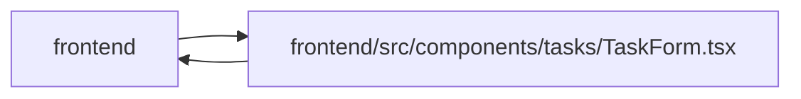

# TaskForm Module

**Path:** `frontend/src/components/tasks/TaskForm.tsx`

## Description

_Auto-generated from `frontend/src/components/tasks/TaskForm.tsx`._

Task drafts have explicit dirty/pending guards and same-account recovery storage. Conflicts load current state before an explicit reapply; saving stays disabled while that refresh is incomplete. Stable labels/disclosure state identify controls, and baselines, forecasts and actual events remain distinct in the editor.

## Imports

| Source | Symbols |
|--------|---------|
| `../../features/identity/identityContext` | `useIdentity` |
| `../../i18n/seedDisplay` | `templateDisplay` |
| `../../services/iterationService` | `iterationService` |
| `../../services/projectService` | `projectService` |
| `../../services/taskService` | `taskService` |
| `../../services/teamService` | `teamService` |
| `../../services/templateService` | `templateService` |
| `../../services/triageService` | `triageService` |
| `../../types/task` | `GroundedAISuggestionResponse`, `TaskAISuggestRequest`, `TaskCreate`, `Task`, `TaskUpdate` |
| `../../types/template` | `WorkTemplate` |
| `../../types/triage` | `TriageItemCreate` |
| `../../utils/apiError` | `getApiErrorMessage` |
| `../../utils/formatDate` | `formatDate` |
| `../../utils/templateDefaults` | `appendChecklistToDescription`, `getPayloadBoolean`, `getPayloadString`, `mergeLabels` |
| `../common/Button` | `Button` |
| `../common/CollapsibleSection` | `CollapsibleSection` |
| `../common/ConfirmDialog` | `ConfirmDialog` |
| `../common/Input` | `Input` |
| `../feedback/QueryState` | `QueryErrorState` |
| `../labels/LabelSelector` | `LabelSelector` |
| `../team/AssigneeRecommendationsPanel` | `AssigneeRecommendationsPanel` |
| `./StatusChangeControl` | `StatusChangeControl` |
| `./TaskAgentReadinessBadge` | `TaskAgentReadinessBadge` |
| `./TaskDependencySelector` | `TaskDependencySelector` |
| `./TaskTimelinePanel` | `TaskTimelinePanel` |
| `./taskDraftStorage` | `readTaskDraft`, `writeTaskDraft`, `removeTaskDraft` |
| `./taskEditorContract` | `buildTaskEditorDefaults`, `mapTaskEditorServerError`, `toTaskCreate`, `toTaskUpdate`, `validateTaskEditor`, `TaskConflictMetadata`, `TaskEditorValues` |
| `@tanstack/react-query` | `useMutation`, `useQueryClient`, `useQuery` |
| `lucide-react` | `Inbox`, `Save`, `Sparkles` |
| `react` | `useCallback`, `useEffect`, `useId`, `useMemo`, `useState` |
| `react-i18next` | `useTranslation` |

## Module Signals

| Signal | Values |
|--------|--------|
| Exports | `TaskForm` |

## Local dependency map

<!-- Auto-generated local dependency summary. Do not edit by hand. -->

> Module-level dependencies exceed the generated-diagram limits, so the diagram and table below group them by top-level package. Counts report the number of module neighbors in each package.

### Internal neighbors

| Direction | Module |
|---|---|
| Inbound | `frontend` (3) |
| Outbound | `frontend` (27) |

### External packages

| Language | Used packages | Undeclared packages |
|---|---:|---:|
| typescript | 4 | 0 |

> All 30 module neighbor(s) are summarized by package because the module-level view exceeds the 12-node limit.

## Classes

| Class | Kind | Line | Bases / Target | Description |
|-------|------|------|----------------|-------------|
| [TaskFormProps](../entities/TaskFormProps.md) | Class | 47 | — | — |

## Functions

| Function | Signature | Decorators | Description |
|----------|-----------|------------|-------------|
| `TaskForm` | `({     iterationId,     initialData,     parentId,     parentPriority,     parentProjectId,     parentMilestoneId,     onSuccess,     onCancel,     mode = 'direct',     onSaveSandbox,     onDirtyChange,     onPendingChange,     onDiscardReady,     confirmUnsavedOnCancel = true, }: TaskFormProps)` | — | — |
