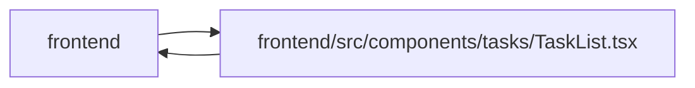

# TaskList Module

**Path:** `frontend/src/components/tasks/TaskList.tsx`

## Description

Merge drafts capture the aggregate revision when their confirmation editor opens. Live list updates do not replace it at submission; conflicts retain title/selection and expose explicit current-input review.

## Imports

| Source | Symbols |
|--------|---------|
| `../../services/labelService` | `labelService` |
| `../../services/taskService` | `taskService` |
| `../../types/label` | `Label` |
| `../../types/task` | `Task` |
| `../../utils/apiError` | `getApiErrorMessage` |
| `../../utils/graphLimitError` | `isGraphLimitError` |
| `../../utils/taskFilters` | `filterTaskWithChildren` |
| `../../utils/visibleWork` | `selectVisibleWork` |
| `../common/Button` | `Button` |
| `../common/ConfirmDialog` | `ConfirmDialog` |
| `../common/Modal` | `Modal` |
| `../feedback/QueryState` | `QueryErrorState`, `QueryLoadingState` |
| `../feedback/WorkFreshness` | `WorkFreshness` |
| `../feedback/toast` | `useToast` |
| `../ui` | `OverflowMenu` |
| `../ui/tone` | `statusTextClassName` |
| `./GuardedTaskModal` | `GuardedTaskModal` |
| `./PagedTaskBrowser` | `PagedTaskBrowser` |
| `./TaskAgentReadinessBadge` | `TaskAgentReadinessBadge` |
| `./TaskBulkOperationsPanel` | `TaskBulkOperationsPanel` |
| `./TaskFiltersBar` | `TaskFilters` |
| `@dnd-kit/core` | `DndContext`, `closestCenter`, `KeyboardSensor`, `PointerSensor`, `useSensor`, `useSensors`, `DragEndEvent` |
| `@dnd-kit/sortable` | `arrayMove`, `SortableContext`, `sortableKeyboardCoordinates`, `useSortable`, `verticalListSortingStrategy` |
| `@dnd-kit/utilities` | `CSS` |
| `@tanstack/react-query` | `useQuery`, `useMutation`, `useQueryClient` |
| `clsx` | `clsx` |
| `lucide-react` | `ChevronRight`, `ChevronDown`, `CheckCircle2`, `Circle`, `Trash2`, `Plus`, `Edit`, `CornerDownRight`, `AlertTriangle`, `ArrowUpDown`, `GripVertical`, `Layers`, `Unlink`, `Bot`, `ClipboardCheck` |
| `react` | `useCallback`, `useEffect`, `useId`, `useMemo`, `useRef`, `useState` |
| `react-i18next` | `useTranslation` |

## Module Signals

| Signal | Values |
|--------|--------|
| Exports | `SortKey`, `TaskList`, `TaskMode` |

## Local dependency map

<!-- Auto-generated local dependency summary. Do not edit by hand. -->

> Module-level dependencies exceed the generated-diagram limits, so the diagram and table below group them by top-level package. Counts report the number of module neighbors in each package.

### Internal neighbors

| Direction | Module |
|---|---|
| Inbound | `frontend` (4) |
| Outbound | `frontend` (21) |

### External packages

| Language | Used packages | Undeclared packages |
|---|---:|---:|
| typescript | 8 | 0 |

> All 25 module neighbor(s) are summarized by package because the module-level view exceeds the 12-node limit.

## Classes

| Class | Kind | Line | Bases / Target | Description |
|-------|------|------|----------------|-------------|
| [TaskListProps](../entities/TaskListProps.md) | Class | 70 | — | — |
| [TaskItemProps](../entities/TaskItemProps.md) | Class | 740 | — | — |
| [TaskItemContentProps](../entities/TaskItemContentProps.md) | Class | 792 | `TaskItemProps` | — |
| [SortKey](../entities/SortKey.md) | Type alias | 48 | — | — |
| [TaskMode](../entities/TaskMode.md) | Type alias | 49 | — | — |
| [TaskOrderRequest](../entities/TaskOrderRequest.md) | Type alias | 50 | — | — |
| [ReorderVariables](../entities/ReorderVariables.md) | Type alias | 51 | — | — |

## Functions

| Function | Signature | Decorators | Description |
|----------|-----------|------------|-------------|
| `TaskList` | `({     iterationId,     filters,     sortKey,     onSortKeyChange,     hasActiveFilters = false,     activeViewName,     onClearFilters,     onCreateTask,     requestedMode,     onModeChange, }: TaskListProps)` | — | — |
