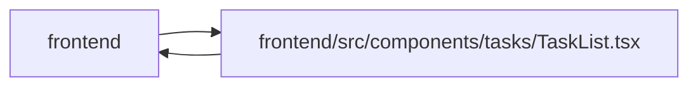

# TaskList Module

**Path:** `frontend/src/components/tasks/TaskList.tsx`

## Description

Merge drafts capture the aggregate revision when their confirmation editor opens. Live list updates do not replace it at submission; conflicts retain title/selection and expose explicit current-input review. Bulk selection is a visible toolbar action; a hand-off into bulk mode selects every matching task once.

## Imports

| Source | Symbols | Type-only | Runtime emission |
|--------|---------|-----------|------------------|
| `../../features/firstRun/NextStepEmptyState` | `NextStepEmptyState` | — | compiler-dependent |
| `../../features/firstRun/firstRunSteps` | `firstRunPlanHref` | — | compiler-dependent |
| `../../features/planningMasters/atRiskReasons` | `atRiskReasons` | — | compiler-dependent |
| `../../features/scope/useScopeLink` | `useScopeLink` | — | compiler-dependent |
| `../../services/labelService` | `labelService` | — | compiler-dependent |
| `../../services/taskService` | `taskService` | — | compiler-dependent |
| `../../types/label` | `Label` | Declaration | erased |
| `../../types/task` | `Task`, `TaskStatus` | Declaration | erased |
| `../../utils/apiError` | `getApiErrorMessage` | — | compiler-dependent |
| `../../utils/graphLimitError` | `isGraphLimitError` | — | compiler-dependent |
| `../../utils/taskFilters` | `filterTaskBySearch`, `filterTaskWithChildren` | — | compiler-dependent |
| `../../utils/visibleWork` | `selectVisibleWork` | — | compiler-dependent |
| `../common/Button` | `Button` | — | compiler-dependent |
| `../common/ConfirmDialog` | `ConfirmDialog` | — | compiler-dependent |
| `../feedback/QueryState` | `QueryErrorState`, `QueryLoadingState` | — | compiler-dependent |
| `../feedback/WorkFreshness` | `WorkFreshness` | — | compiler-dependent |
| `../feedback/toast` | `useToast` | — | compiler-dependent |
| `../labels/LabelChip` | `LabelChip` | — | compiler-dependent |
| `../ui/InlineEmptyState` | `InlineEmptyState` | — | compiler-dependent |
| `../ui/tone` | `statusTextClassName` | — | compiler-dependent |
| `./GuardedTaskDrawer` | `GuardedTaskDrawer` | — | compiler-dependent |
| `./PagedTaskBrowser` | `PagedTaskBrowser` | — | compiler-dependent |
| `./TaskAgentReadinessBadge` | `TaskAgentReadinessBadge` | — | compiler-dependent |
| `./TaskFiltersBar` | `TaskFilters` | Declaration | erased |
| `./TaskRow` | `TaskRowAssigneeOption` | Declaration | erased |
| `./TaskRow` | `TaskRow` | — | compiler-dependent |
| `./TaskSelectionBar` | `TaskSelectionBar` | — | compiler-dependent |
| `./taskRowValues` | `getEffectiveEffort` | — | compiler-dependent |
| `./taskStateChip` | `taskStateChip` | — | compiler-dependent |
| `./useAgentRowFacts` | `AgentRowFacts` | Declaration | erased |
| `./useAgentRowFacts` | `agentRowValues`, `useAgentRowFacts` | — | compiler-dependent |
| `./useTaskRowEdits` | `useAssigneeOptions`, `useTaskRowEdits` | — | compiler-dependent |
| `./useTaskSelection` | `useTaskSelection` | — | compiler-dependent |
| `@dnd-kit/core` | `DragEndEvent` | Declaration | erased |
| `@dnd-kit/core` | `DndContext`, `closestCenter`, `KeyboardSensor`, `PointerSensor`, `useSensor`, `useSensors` | — | compiler-dependent |
| `@dnd-kit/sortable` | `arrayMove`, `SortableContext`, `sortableKeyboardCoordinates`, `useSortable`, `verticalListSortingStrategy` | — | compiler-dependent |
| `@dnd-kit/utilities` | `CSS` | — | compiler-dependent |
| `@tanstack/react-query` | `useQuery`, `useMutation`, `useQueryClient` | — | compiler-dependent |
| `@tanstack/react-virtual` | `useVirtualizer` | — | compiler-dependent |
| `clsx` | `clsx` | — | compiler-dependent |
| `lucide-react` | `ChevronRight`, `ChevronDown`, `Trash2`, `Plus`, `Edit`, `AlertTriangle`, `GripVertical`, `Unlink`, `Bot`, `Info` | — | compiler-dependent |
| `react` | `ReactNode` | Declaration | erased |
| `react` | `Fragment`, `useCallback`, `useEffect`, `useId`, `useLayoutEffect`, `useMemo`, `useState` | — | compiler-dependent |
| `react-dom` | `createPortal` | — | compiler-dependent |
| `react-i18next` | `useTranslation` | — | compiler-dependent |
| `react-router-dom` | `useSearchParams` | — | compiler-dependent |

## Module Signals

| Signal | Values |
|--------|--------|
| Exports | `SortKey`, `TaskList`, `TaskMode` |
| Constants | `STATUS_GROUP_ORDER`, `VIRTUALIZE_AFTER_ROWS`, `ROW_HEIGHT` |

## Local dependency map

<!-- Auto-generated local dependency summary. Do not edit by hand. -->
This graph shows full source coupling. Type dependencies can be erased; compiler-dependent cycle groups are runtime candidates, not confirmed initialization cycles.

```mermaid
flowchart LR
    n0["frontend"]
    n1["frontend/src/components/tasks/TaskList.tsx"]
    n0 --> n1
    n1 --> n0
    click n1 "../modules/TaskList.md"
```

> Module-level dependencies exceed the generated-diagram limits, so the diagram and table below group them by top-level package. Counts report the number of module neighbors in each package.

### Internal neighbors

| Direction | Module |
|---|---|
| Inbound | `frontend` (6) |
| Outbound | `frontend` (31) |

### External packages

| Language | Used packages | Undeclared packages |
|---|---:|---:|
| typescript | 11 | 0 |

> All 37 module neighbor(s) are summarized by package because the module-level view exceeds the 12-node limit.

## Classes

| Class | Kind | Line | Bases / Target | Description |
|-------|------|------|----------------|-------------|
| [TaskListProps](../entities/TaskListProps.md) | Interface | 85 | — | — |
| [RowContext](../entities/RowContext.md) | Interface | 607 | — | What every row of the list shares: selection, hierarchy state and inline edits. |
| [TaskItemProps](../entities/TaskItemProps.md) | Interface | 632 | — | — |
| [TaskItemContentProps](../entities/TaskItemContentProps.md) | Interface | 667 | `TaskItemProps` | — |
| [SortKey](../entities/TaskList_SortKey.md) | Type alias | 64 | `'priority' \| 'sort_order' \| 'status' \| 'title'` | — |
| [TaskMode](../entities/TaskMode.md) | Type alias | 65 | `'bulk' \| 'merge'` | — |
| [RowItem](../entities/RowItem.md) | Type alias | 72 | `{ kind: 'group'; status: string; count: number; collapsed: boolean } \| { kind: 'task'; task: Task }` | — |
| [TaskOrderRequest](../entities/TaskOrderRequest.md) | Type alias | 74 | `Parameters<typeof taskService.reorder>[0]` | — |
| [ReorderVariables](../entities/ReorderVariables.md) | Type alias | 75 | <pre><code>&#123;&#10;    order&#58; TaskOrderRequest&#59;&#10;    undoOrder&#58; TaskOrderRequest&#59;&#10;&#125;</code></pre> | — |

## Functions

| Function | Signature | Decorators | Description |
|----------|-----------|------------|-------------|
| `TaskList` | <pre><code>&#40;&#123;&#10;    iterationId&#44;&#10;    filters&#44;&#10;    sortKey&#44;&#10;    groupByStatus &#61; true&#44;&#10;    leadingRow&#44;&#10;    selectionBarHost&#44;&#10;    hasActiveFilters &#61; false&#44;&#10;    activeViewName&#44;&#10;    onClearFilters&#44;&#10;    onCreateTask&#44;&#10;    requestedMode&#44;&#10;    onModeChange&#44;&#10;    preselectAllInBulk &#61; false&#44;&#10;    onOpenTask&#44;&#10;&#125;&#58; TaskListProps&#41;</code></pre> | — | — |
