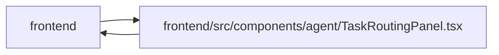

# TaskRoutingPanel Module

**Path:** `frontend/src/components/agent/TaskRoutingPanel.tsx`

## Description

_Auto-generated from `frontend/src/components/agent/TaskRoutingPanel.tsx`._

## Imports

| Source | Symbols |
|--------|---------|
| `../../hooks/useAgentAccess` | `useAgentAccess` |
| `../../services/agentService` | `agentService` |
| `../../types/agent` | `AgentAssignmentPurpose`, `AgentRoutingCandidate`, `AgentTaskAssignment`, `AssessmentReasonCode`, `ModelContextTier`, `ModelReasoningTier`, `TaskDifficultyAxes`, `TaskDifficultyScore`, `TaskReviewMode`, `TaskRoutingAssessment`, `TaskRoutingAssessmentCommand`, `TaskSkillLevel` |
| `../../types/task` | `Task` |
| `../../utils/apiError` | `normalizeApiError` |
| `../../utils/formatDate` | `formatDateTime` |
| `../../utils/modelRouting` | `ASSESSMENT_REASON_CODES`, `createAgentCommandMetadata`, `deriveDifficultyBand`, `formatRoutingCode`, `minimumReviewMode`, `MODEL_AWARE_ROUTING_FEATURE`, `parseRoutingTags`, `reviewModeMeets` |
| `../../utils/protectedQueries` | `protectedQueryRetry` |
| `../common/Button` | `Button` |
| `../common/Checkbox` | `Checkbox` |
| `../common/Input` | `Input`, `RequiredIndicator` |
| `../feedback/QueryState` | `QueryEmptyState`, `QueryErrorState`, `QueryLoadingState` |
| `../feedback/toast` | `useToast` |
| `./RoutingCandidateComparison` | `RoutingCandidateComparison` |
| `@tanstack/react-query` | `useMutation`, `useQuery`, `useQueryClient` |
| `lucide-react` | `CheckCircle2`, `Plus`, `RefreshCw`, `Route`, `Trash2` |
| `react` | `useEffect`, `useMemo`, `useState`, `FormEvent` |
| `react-i18next` | `useTranslation` |
| `react-router-dom` | `Link` |

## Module Signals

| Signal | Values |
|--------|--------|
| Exports | `TaskRoutingPanel` |
| Constants | `DEFAULT_DRAFT`, `AXIS_KEYS`, `REVIEW_MODES`, `SKILL_CATALOG_READ_SCOPES`, `TEAM_ASSIGNMENT_READ_SCOPES` |
| Module calls | `SKILL_CATALOG_READ_SCOPES = Set`, `TEAM_ASSIGNMENT_READ_SCOPES = Set` |

## Local dependency map

<!-- Auto-generated local dependency summary. Do not edit by hand. -->

> Module-level dependencies exceed the generated-diagram limits, so the diagram and table below group them by top-level package. Counts report the number of module neighbors in each package.

### Internal neighbors

| Direction | Module |
|---|---|
| Inbound | `frontend` (2) |
| Outbound | `frontend` (14) |

### External packages

| Language | Used packages | Undeclared packages |
|---|---:|---:|
| typescript | 5 | 0 |

> All 16 module neighbor(s) are summarized by package because the module-level view exceeds the 12-node limit.

## Classes

| Class | Kind | Line | Bases / Target | Description |
|-------|------|------|----------------|-------------|
| [TaskRoutingPanelProps](../entities/TaskRoutingPanelProps.md) | Class | 54 | — | — |
| [AssessmentDraft](../entities/AssessmentDraft.md) | Class | 59 | — | — |

## Functions

| Function | Signature | Decorators | Description |
|----------|-----------|------------|-------------|
| `TaskRoutingPanel` | `({ task, onAssigned }: TaskRoutingPanelProps)` | — | — |
