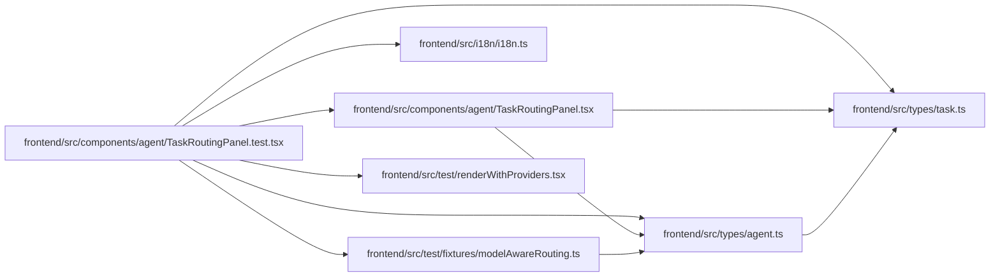

# TaskRoutingPanel.test Module

**Path:** `frontend/src/components/agent/TaskRoutingPanel.test.tsx`

## Description

_Auto-generated from `frontend/src/components/agent/TaskRoutingPanel.test.tsx`._

## Imports

| Source | Symbols |
|--------|---------|
| `../../i18n/i18n` | `i18n` |
| `../../test/fixtures/modelAwareRouting` | `modelAwareRoutingPreview`, `modelAwareRoutingRoster` |
| `../../test/renderWithProviders` | `renderWithProviders` |
| `../../types/agent` | `AgentActorRosterItem`, `AgentCapabilities`, `AgentModelBinding`, `AgentModelCatalogEntry`, `AgentRoutingPreviewResponse`, `AgentTaskAssignment`, `TaskRoutingAssessment`, `TaskRoutingAssessmentState` |
| `../../types/task` | `Task` |
| `./TaskRoutingPanel` | `TaskRoutingPanel` |
| `@testing-library/react` | `screen`, `waitFor` |
| `vitest` | `beforeEach`, `describe`, `expect`, `it`, `vi` |

## Module Signals

| Signal | Values |
|--------|--------|
| Constants | `agentServiceMock`, `useAgentAccessMock`, `taskFixture`, `currentAssessment`, `currentAssessmentState`, `modelCatalog`, `modelBinding`, `dispatchableRoster`, `pendingRecoveryAssignment`, `capabilities` |
| Module calls | `agentServiceMock = hoisted`, `useAgentAccessMock = hoisted`, `mock`, `mock`, `dispatchableRoster = map`, `describe` |

## Local dependency map

<!-- Auto-generated local dependency summary. Do not edit by hand. -->

### Internal neighbors

| Direction | Module |
|---|---|
| Outbound | [TaskRoutingPanel](../modules/TaskRoutingPanel.md) |
| Outbound | [i18n](../modules/i18n.md) |
| Outbound | [modelAwareRouting](../modules/modelAwareRouting.md) |
| Outbound | [renderWithProviders](../modules/renderWithProviders.md) |
| Outbound | [types_agent](../modules/types_agent.md) |
| Outbound | [types_task](../modules/types_task.md) |

### External packages

| Language | Used packages | Undeclared packages |
|---|---:|---:|
| typescript | 2 | 0 |
