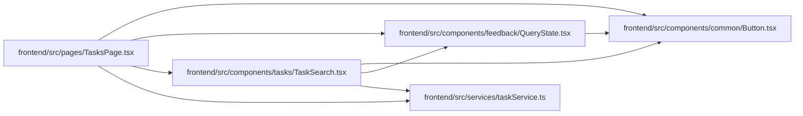

# TaskSearch Module

**Path:** `frontend/src/components/tasks/TaskSearch.tsx`

## Description

Searches authorized title/ID projections with bounded pagination and project/iteration context. The query stays in the URL and opening a result retains the surrounding view parameters.

## Imports

| Source | Symbols |
|--------|---------|
| `../../services/taskService` | `taskService` |
| `../common/Button` | `Button` |
| `../feedback/QueryState` | `QueryErrorState` |
| `@tanstack/react-query` | `useInfiniteQuery` |
| `react` | `useEffect`, `useId`, `useState` |
| `react-i18next` | `useTranslation` |
| `react-router-dom` | `Link`, `useSearchParams` |

## Module Signals

| Signal | Values |
|--------|--------|
| Exports | `TaskSearch` |

## Local dependency map

<!-- Auto-generated local dependency summary. Do not edit by hand. -->

### Internal neighbors

| Direction | Module |
|---|---|
| Inbound | [TasksPage](../modules/TasksPage.md) |
| Outbound | [Button](../modules/Button.md) |
| Outbound | [QueryState](../modules/QueryState.md) |
| Outbound | [taskService](../modules/taskService.md) |

### External packages

| Language | Used packages | Undeclared packages |
|---|---:|---:|
| typescript | 4 | 0 |

## Functions

| Function | Signature | Decorators | Description |
|----------|-----------|------------|-------------|
| `TaskSearch` | `()` | — | — |
