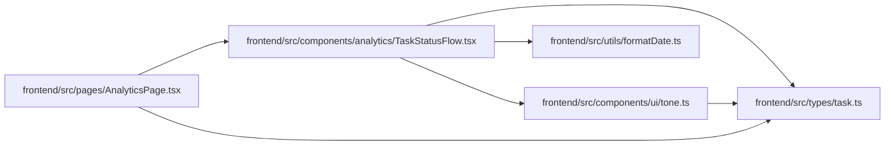

# TaskStatusFlow Module

**Path:** `frontend/src/components/analytics/TaskStatusFlow.tsx`

## Description

_Auto-generated from `frontend/src/components/analytics/TaskStatusFlow.tsx`._

## Imports

| Source | Symbols |
|--------|---------|
| `../../types/task` | `TaskStatus`, `TaskStatusLog` |
| `../../utils/formatDate` | `formatDateTime` |
| `../ui/tone` | `STATUS_TONE`, `toneBorderClassName` |
| `clsx` | `clsx` |
| `lucide-react` | `ArrowRight` |
| `react` | `React` |
| `react-i18next` | `useTranslation` |

## Module Signals

| Signal | Values |
|--------|--------|
| Exports | `TaskStatusFlow` |

## Local dependency map

<!-- Auto-generated local dependency summary. Do not edit by hand. -->

### Internal neighbors

| Direction | Module |
|---|---|
| Inbound | [AnalyticsPage](../modules/AnalyticsPage.md) |
| Outbound | [tone](../modules/tone.md) |
| Outbound | [types_task](../modules/types_task.md) |
| Outbound | [formatDate](../modules/formatDate.md) |

### External packages

| Language | Used packages | Undeclared packages |
|---|---:|---:|
| typescript | 4 | 0 |

## Classes

| Class | Kind | Line | Bases / Target | Description |
|-------|------|------|----------------|-------------|
| [TaskStatusFlowProps](../entities/TaskStatusFlowProps.md) | Class | 9 | — | — |

## Functions

| Function | Signature | Decorators | Description |
|----------|-----------|------------|-------------|
| `TaskStatusFlow` | `({ logs })` | — | — |
