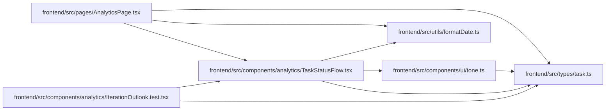

# TaskStatusFlow Module

**Path:** `frontend/src/components/analytics/TaskStatusFlow.tsx`

## Description

_Auto-generated from `frontend/src/components/analytics/TaskStatusFlow.tsx`._

## Imports

| Source | Symbols | Type-only | Runtime emission |
|--------|---------|-----------|------------------|
| `../../types/task` | `TaskStatusLog` | Declaration | erased |
| `../../utils/formatDate` | `formatDateTime` | — | compiler-dependent |
| `../ui/tone` | `STATUS_TONE`, `toneVar` | — | compiler-dependent |
| `i18next` | `TFunction` | Declaration | erased |
| `react` | `useState` | — | compiler-dependent |
| `react-i18next` | `useTranslation` | — | compiler-dependent |
| `react-router-dom` | `Link` | — | compiler-dependent |

## Module Signals

| Signal | Values |
|--------|--------|
| Exports | `TaskStatusFlow` |
| Constants | `HOUR` |

## Local dependency map

<!-- Auto-generated local dependency summary. Do not edit by hand. -->
This graph shows full source coupling. Type dependencies can be erased; compiler-dependent cycle groups are runtime candidates, not confirmed initialization cycles.

```mermaid
flowchart LR
    n0["frontend/src/components/analytics/IterationOutlook.test.tsx"]
    n1["frontend/src/components/analytics/TaskStatusFlow.tsx"]
    n2["frontend/src/components/ui/tone.ts"]
    n3["frontend/src/pages/AnalyticsPage.tsx"]
    n4["frontend/src/types/task.ts"]
    n5["frontend/src/utils/formatDate.ts"]
    n0 --> n1
    n0 --> n4
    n1 --> n2
    n1 --> n4
    n1 --> n5
    n2 --> n4
    n3 --> n1
    n3 --> n4
    n3 --> n5
    click n0 "../modules/IterationOutlook.test.md"
    click n1 "../modules/TaskStatusFlow.md"
    click n2 "../modules/tone.md"
    click n3 "../modules/AnalyticsPage.md"
    click n4 "../modules/types_task.md"
    click n5 "../modules/formatDate.md"
```

### Internal neighbors

| Direction | Module |
|---|---|
| Inbound | [IterationOutlook.test](../modules/IterationOutlook.test.md) |
| Inbound | [AnalyticsPage](../modules/AnalyticsPage.md) |
| Outbound | [tone](../modules/tone.md) |
| Outbound | [types_task](../modules/types_task.md) |
| Outbound | [formatDate](../modules/formatDate.md) |

### External packages

| Language | Used packages | Undeclared packages |
|---|---:|---:|
| typescript | 4 | 0 |

## Functions

| Function | Signature | Decorators | Description |
|----------|-----------|------------|-------------|
| `TaskStatusFlow` | `({ taskId, title, logs, nowMs }: { taskId: number; title: string; logs: TaskStatusLog[]; nowMs?: number })` | — | One task's states in order, with the time spent in each. The current state is |
