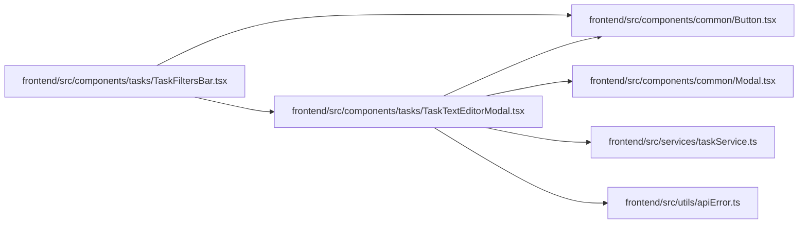

# TaskTextEditorModal Module

**Path:** `frontend/src/components/tasks/TaskTextEditorModal.tsx`

## Description

_Auto-generated from `frontend/src/components/tasks/TaskTextEditorModal.tsx`._

## Imports

| Source | Symbols |
|--------|---------|
| `../../services/taskService` | `taskService` |
| `../../utils/apiError` | `getApiErrorMessage` |
| `../common/Button` | `Button` |
| `../common/Modal` | `Modal` |
| `@tanstack/react-query` | `useMutation`, `useQuery`, `useQueryClient` |
| `clsx` | `clsx` |
| `lucide-react` | `Save`, `FileText`, `AlertCircle`, `CheckCircle`, `Loader2`, `Maximize2`, `Minimize2` |
| `react` | `useRef`, `useState` |
| `react-i18next` | `useTranslation` |

## Module Signals

| Signal | Values |
|--------|--------|
| Exports | `TaskTextEditorModal` |

## Local dependency map

<!-- Auto-generated local dependency summary. Do not edit by hand. -->

### Internal neighbors

| Direction | Module |
|---|---|
| Inbound | [TaskFiltersBar](../modules/TaskFiltersBar.md) |
| Outbound | [Button](../modules/Button.md) |
| Outbound | [Modal](../modules/Modal.md) |
| Outbound | [taskService](../modules/taskService.md) |
| Outbound | [apiError](../modules/apiError.md) |

### External packages

| Language | Used packages | Undeclared packages |
|---|---:|---:|
| typescript | 5 | 0 |

## Classes

| Class | Kind | Line | Bases / Target | Description |
|-------|------|------|----------------|-------------|
| [TaskTextEditorModalProps](../entities/TaskTextEditorModalProps.md) | Class | 11 | — | — |
| [TaskTextEditorBodyProps](../entities/TaskTextEditorBodyProps.md) | Class | 36 | `TaskTextEditorModalProps` | — |

## Functions

| Function | Signature | Decorators | Description |
|----------|-----------|------------|-------------|
| `TaskTextEditorModal` | `({ iterationId, onClose }: TaskTextEditorModalProps)` | — | — |
