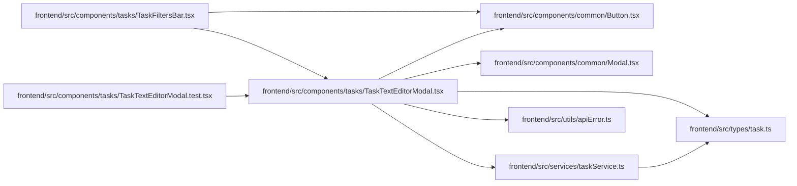

# TaskTextEditorModal Module

**Path:** `frontend/src/components/tasks/TaskTextEditorModal.tsx`

## Description

The editor captures text and its iteration revision together. Background query refreshes cannot replace the draft or advance its editing base. Conflicts retain input and require explicit comparison with current server text before rebinding the revision; no mutation is retried automatically. Pending writes make the editor read-only, and successful apply closes the editor.

_Auto-generated from `frontend/src/components/tasks/TaskTextEditorModal.tsx`._

## Imports

| Source | Symbols |
|--------|---------|
| `../../services/taskService` | `taskService` |
| `../../types/task` | `TaskTextContext` |
| `../../utils/apiError` | `getApiErrorMessage`, `normalizeApiError` |
| `../common/Button` | `Button` |
| `../common/Modal` | `Modal` |
| `@tanstack/react-query` | `useMutation`, `useQuery`, `useQueryClient` |
| `clsx` | `clsx` |
| `lucide-react` | `Save`, `FileText`, `AlertCircle`, `CheckCircle`, `Loader2`, `Maximize2`, `Minimize2` |
| `react` | `useRef`, `useState` |
| `react-i18next` | `useTranslation` |

## Module Signals

| Signal | Values |
|--------|--------|
| Exports | `TaskTextEditorModal` |

## Local dependency map

<!-- Auto-generated local dependency summary. Do not edit by hand. -->

### Internal neighbors

| Direction | Module |
|---|---|
| Inbound | [TaskFiltersBar](../modules/TaskFiltersBar.md) |
| Inbound | [TaskTextEditorModal.test](../modules/TaskTextEditorModal.test.md) |
| Outbound | [Button](../modules/Button.md) |
| Outbound | [Modal](../modules/Modal.md) |
| Outbound | [taskService](../modules/taskService.md) |
| Outbound | [types_task](../modules/types_task.md) |
| Outbound | [apiError](../modules/apiError.md) |

### External packages

| Language | Used packages | Undeclared packages |
|---|---:|---:|
| typescript | 5 | 0 |

## Classes

| Class | Kind | Line | Bases / Target | Description |
|-------|------|------|----------------|-------------|
| [TaskTextEditorModalProps](../entities/TaskTextEditorModalProps.md) | Class | 12 | — | — |
| [TaskTextEditorBodyProps](../entities/TaskTextEditorBodyProps.md) | Class | 39 | `TaskTextEditorModalProps` | — |

## Functions

| Function | Signature | Decorators | Description |
|----------|-----------|------------|-------------|
| `TaskTextEditorModal` | `({ iterationId, onClose }: TaskTextEditorModalProps)` | — | — |
