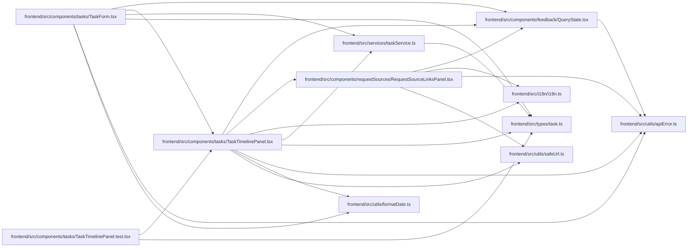

# TaskTimelinePanel Module

**Path:** `frontend/src/components/tasks/TaskTimelinePanel.tsx`

## Description

Merged history uses explicit bounded continuation. External-link read failures hide cached private links and their controls while retaining error/retry feedback; prior successful data does not imply current access.

_Auto-generated from `frontend/src/components/tasks/TaskTimelinePanel.tsx`._

## Imports

| Source | Symbols |
|--------|---------|
| `../../i18n/i18n` | `i18n` |
| `../../services/taskService` | `taskService` |
| `../../types/task` | `ExternalLink`, `Task` |
| `../../utils/apiError` | `getApiErrorMessage` |
| `../../utils/formatDate` | `formatDateTime` |
| `../../utils/safeUrl` | `safeExternalHref` |
| `../feedback/QueryState` | `QueryErrorState` |
| `../requestSources/RequestSourceLinksPanel` | `RequestSourceLinksPanel` |
| `@tanstack/react-query` | `useInfiniteQuery`, `useMutation`, `useQuery`, `useQueryClient` |
| `clsx` | `clsx` |
| `lucide-react` | `Bot`, `CircleDot`, `GitBranch`, `History`, `Link`, `Plus`, `RefreshCw`, `Trash2`, `X` |
| `react` | `useState`, `KeyboardEvent` |
| `react-i18next` | `useTranslation` |

## Module Signals

| Signal | Values |
|--------|--------|
| Exports | `TaskTimelinePanel` |
| Constants | `t`, `itemLabels`, `githubUrlPattern` |
| Module calls | `t = bind` |

## Local dependency map

<!-- Auto-generated local dependency summary. Do not edit by hand. -->

### Internal neighbors

| Direction | Module |
|---|---|
| Inbound | [TaskForm](../modules/TaskForm.md) |
| Inbound | [TaskTimelinePanel.test](../modules/TaskTimelinePanel.test.md) |
| Outbound | [QueryState](../modules/QueryState.md) |
| Outbound | [RequestSourceLinksPanel](../modules/RequestSourceLinksPanel.md) |
| Outbound | [i18n](../modules/i18n.md) |
| Outbound | [taskService](../modules/taskService.md) |
| Outbound | [types_task](../modules/types_task.md) |
| Outbound | [apiError](../modules/apiError.md) |
| Outbound | [formatDate](../modules/formatDate.md) |
| Outbound | [safeUrl](../modules/safeUrl.md) |

### External packages

| Language | Used packages | Undeclared packages |
|---|---:|---:|
| typescript | 5 | 0 |

## Classes

| Class | Kind | Line | Bases / Target | Description |
|-------|------|------|----------------|-------------|
| [TaskTimelinePanelProps](../entities/TaskTimelinePanelProps.md) | Class | 17 | — | — |

## Functions

| Function | Signature | Decorators | Description |
|----------|-----------|------------|-------------|
| `TaskTimelinePanel` | `({ task }: TaskTimelinePanelProps)` | — | — |