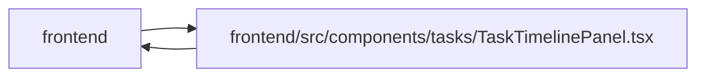

# TaskTimelinePanel Module

**Path:** `frontend/src/components/tasks/TaskTimelinePanel.tsx`

## Description

Merged history uses explicit bounded continuation. External-link read failures hide cached private links and their controls while retaining error/retry feedback; prior successful data does not imply current access.

_Auto-generated from `frontend/src/components/tasks/TaskTimelinePanel.tsx`._

## Imports

| Source | Symbols | Type-only | Runtime emission |
|--------|---------|-----------|------------------|
| `../../components/common/Button` | `Button` | — | compiler-dependent |
| `../../i18n/i18n` | `i18n` | — | compiler-dependent |
| `../../services/taskService` | `taskService` | — | compiler-dependent |
| `../../types/task` | `ExternalLink`, `Task` | Declaration | erased |
| `../../utils/apiError` | `getApiErrorMessage` | — | compiler-dependent |
| `../../utils/formatDate` | `formatDateTime` | — | compiler-dependent |
| `../../utils/safeUrl` | `safeExternalHref` | — | compiler-dependent |
| `../feedback/QueryState` | `QueryErrorState` | — | compiler-dependent |
| `../requestSources/RequestSourceLinksPanel` | `RequestSourceLinksPanel` | — | compiler-dependent |
| `@tanstack/react-query` | `useInfiniteQuery`, `useMutation`, `useQuery`, `useQueryClient` | — | compiler-dependent |
| `clsx` | `clsx` | — | compiler-dependent |
| `lucide-react` | `Activity`, `Bot`, `CircleDot`, `GitBranch`, `History`, `Link`, `Plus`, `RefreshCw`, `Trash2`, `X` | — | compiler-dependent |
| `react` | `KeyboardEvent` | Specifier | compiler-dependent |
| `react` | `useState` | — | compiler-dependent |
| `react-i18next` | `useTranslation` | — | compiler-dependent |

## Module Signals

| Signal | Values |
|--------|--------|
| Exports | `TaskTimelinePanel` |
| Constants | `t`, `itemLabels`, `AGDASH`, `LOOPBACK_HOSTS`, `githubUrlPattern` |
| Module calls | `t = bind`, `LOOPBACK_HOSTS = Set` |

## Local dependency map

<!-- Auto-generated local dependency summary. Do not edit by hand. -->
This graph shows full source coupling. Type dependencies can be erased; compiler-dependent cycle groups are runtime candidates, not confirmed initialization cycles.

```mermaid
flowchart LR
    n0["frontend"]
    n1["frontend/src/components/tasks/TaskTimelinePanel.tsx"]
    n0 --> n1
    n1 --> n0
    click n1 "../modules/TaskTimelinePanel.md"
```

> Module-level dependencies exceed the generated-diagram limits, so the diagram and table below group them by top-level package. Counts report the number of module neighbors in each package.

### Internal neighbors

| Direction | Module |
|---|---|
| Inbound | `frontend` (3) |
| Outbound | `frontend` (9) |

### External packages

| Language | Used packages | Undeclared packages |
|---|---:|---:|
| typescript | 5 | 0 |

> All 12 module neighbor(s) are summarized by package because the module-level view exceeds the 12-node limit.

## Classes

| Class | Kind | Line | Bases / Target | Description |
|-------|------|------|----------------|-------------|
| [TaskTimelinePanelProps](../entities/TaskTimelinePanelProps.md) | Interface | 18 | — | — |

## Functions

| Function | Signature | Decorators | Description |
|----------|-----------|------------|-------------|
| `TaskTimelinePanel` | `({ task }: TaskTimelinePanelProps)` | — | — |