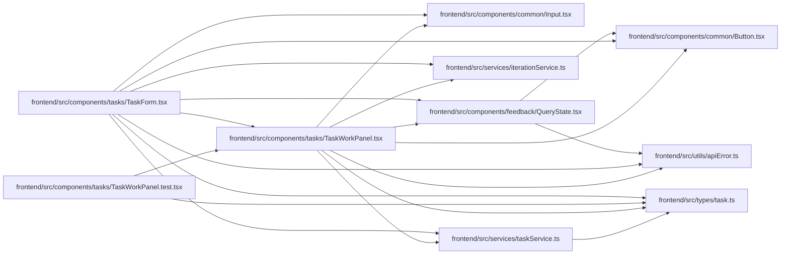

# TaskWorkPanel Module

**Path:** `frontend/src/components/tasks/TaskWorkPanel.tsx`

## Description

_Auto-generated from `frontend/src/components/tasks/TaskWorkPanel.tsx`._

Workflow actions, criterion progress and independent review use explicit server commands. Unsaved evidence gates other commands; metadata editing pauses while a progress/action draft is active. Stale evidence drafts remain visible for review and explicit reapplication. Rejected saves retain their content, and explicit discard clears the progress draft.

## Imports

| Source | Symbols |
|--------|---------|
| `../../services/iterationService` | `iterationService` |
| `../../services/taskService` | `taskService` |
| `../../types/task` | `CriterionProgress`, `Task` |
| `../../utils/apiError` | `getApiErrorMessage` |
| `../common/Button` | `Button` |
| `../common/Input` | `Input` |
| `../feedback/QueryState` | `QueryErrorState`, `QueryLoadingState` |
| `@tanstack/react-query` | `useMutation`, `useQuery` |
| `react` | `useEffect`, `useId`, `useState` |
| `react-i18next` | `useTranslation` |

## Module Signals

| Signal | Values |
|--------|--------|
| Exports | `TaskWorkPanel` |

## Local dependency map

<!-- Auto-generated local dependency summary. Do not edit by hand. -->

### Internal neighbors

| Direction | Module |
|---|---|
| Inbound | [TaskForm](../modules/TaskForm.md) |
| Inbound | [TaskWorkPanel.test](../modules/TaskWorkPanel.test.md) |
| Outbound | [Button](../modules/Button.md) |
| Outbound | [Input](../modules/Input.md) |
| Outbound | [QueryState](../modules/QueryState.md) |
| Outbound | [iterationService](../modules/iterationService.md) |
| Outbound | [taskService](../modules/taskService.md) |
| Outbound | [types_task](../modules/types_task.md) |
| Outbound | [apiError](../modules/apiError.md) |

### External packages

| Language | Used packages | Undeclared packages |
|---|---:|---:|
| typescript | 3 | 0 |

## Functions

| Function | Signature | Decorators | Description |
|----------|-----------|------------|-------------|
| `TaskWorkPanel` | `({ task, disabled, draftKey, onDirty, onPending, onUpdated, onReload }: {     task: Task; disabled: boolean; draftKey: string \| null; onDirty: (dirty: boolean) => void;     onPending: (pending: boolean) => void; onUpdated: (task: Task) => void; onReload: () => void; })` | — | — |