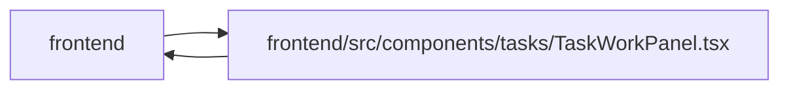

# TaskWorkPanel Module

**Path:** `frontend/src/components/tasks/TaskWorkPanel.tsx`

## Description

Commit and uncommit commands retain original source and selected-target aggregate maps with command input. Scope conflicts preserve the reason and map until explicit current comparison. Obsolete request callbacks cannot clear replacement drafts or pending state.

## Imports

| Source | Symbols |
|--------|---------|
| `../../features/usePlanningObservation` | `usePlanningObservation` |
| `../../services/iterationService` | `iterationService` |
| `../../services/planningInputService` | `ObservedRevisions`, `planningInputService` |
| `../../services/taskService` | `taskService` |
| `../../types/iteration` | `Iteration` |
| `../../types/task` | `CriterionProgress`, `Task` |
| `../../utils/apiError` | `getApiErrorMessage` |
| `../common/Button` | `Button` |
| `../common/Input` | `Input` |
| `../feedback/QueryState` | `QueryErrorState`, `QueryLoadingState` |
| `./useDraftDismissal` | `useActiveMount` |
| `@tanstack/react-query` | `useMutation`, `useQuery` |
| `react` | `useEffect`, `useId`, `useState` |
| `react-i18next` | `useTranslation` |

## Module Signals

| Signal | Values |
|--------|--------|
| Exports | `TaskWorkPanel` |

## Local dependency map

<!-- Auto-generated local dependency summary. Do not edit by hand. -->

> Module-level dependencies exceed the generated-diagram limits, so the diagram and table below group them by top-level package. Counts report the number of module neighbors in each package.

### Internal neighbors

| Direction | Module |
|---|---|
| Inbound | `frontend` (2) |
| Outbound | `frontend` (11) |

### External packages

| Language | Used packages | Undeclared packages |
|---|---:|---:|
| typescript | 3 | 0 |

> All 13 module neighbor(s) are summarized by package because the module-level view exceeds the 12-node limit.

## Functions

| Function | Signature | Decorators | Description |
|----------|-----------|------------|-------------|
| `TaskWorkPanel` | `({ task, disabled, draftKey, onDirty, onPending, onUpdated, onReload }: {     task: Task; disabled: boolean; draftKey: string \| null; onDirty: (dirty: boolean) => void;     onPending: (pending: boolean) => void; onUpdated: (task: Task) => void; onReload: () => void; })` | — | — |