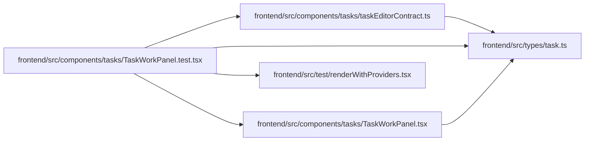

# TaskWorkPanel.test Module

**Path:** `frontend/src/components/tasks/TaskWorkPanel.test.tsx`

## Description

_Auto-generated from `frontend/src/components/tasks/TaskWorkPanel.test.tsx`._

## Imports

| Source | Symbols |
|--------|---------|
| `../../test/renderWithProviders` | `renderWithProviders` |
| `../../types/task` | `Task` |
| `./TaskWorkPanel` | `TaskWorkPanel` |
| `./taskEditorContract` | `emptyTaskBrief` |
| `@testing-library/react` | `screen`, `waitFor` |
| `vitest` | `beforeEach`, `describe`, `expect`, `it`, `vi` |

## Module Signals

| Signal | Values |
|--------|--------|
| Constants | `service`, `task` |
| Module calls | `service = hoisted`, `mock`, `mock`, `describe`, `it` |

## Local dependency map

<!-- Auto-generated local dependency summary. Do not edit by hand. -->

### Internal neighbors

| Direction | Module |
|---|---|
| Outbound | [taskEditorContract](../modules/taskEditorContract.md) |
| Outbound | [TaskWorkPanel](../modules/TaskWorkPanel.md) |
| Outbound | [renderWithProviders](../modules/renderWithProviders.md) |
| Outbound | [types_task](../modules/types_task.md) |

### External packages

| Language | Used packages | Undeclared packages |
|---|---:|---:|
| typescript | 2 | 0 |
