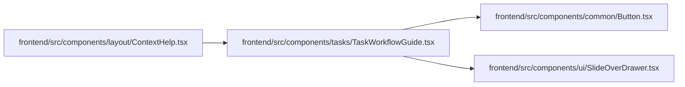

# TaskWorkflowGuide Module

**Path:** `frontend/src/components/tasks/TaskWorkflowGuide.tsx`

## Description

_Auto-generated from `frontend/src/components/tasks/TaskWorkflowGuide.tsx`._

## Imports

| Source | Symbols |
|--------|---------|
| `../common/Button` | `Button` |
| `../ui/SlideOverDrawer` | `SlideOverDrawer` |
| `lucide-react` | `Bot`, `CalendarRange`, `CheckCircle2`, `ChevronRight`, `CircleHelp`, `UserRoundCheck` |
| `react` | `useState` |
| `react-i18next` | `useTranslation` |
| `react-router-dom` | `Link` |

## Module Signals

| Signal | Values |
|--------|--------|
| Exports | `TaskWorkflowGuide`, `TaskWorkflowHelpContent` |

## Local dependency map

<!-- Auto-generated local dependency summary. Do not edit by hand. -->

### Internal neighbors

| Direction | Module |
|---|---|
| Inbound | [ContextHelp](../modules/ContextHelp.md) |
| Outbound | [Button](../modules/Button.md) |
| Outbound | [SlideOverDrawer](../modules/SlideOverDrawer.md) |

### External packages

| Language | Used packages | Undeclared packages |
|---|---:|---:|
| typescript | 4 | 0 |

## Functions

| Function | Signature | Decorators | Description |
|----------|-----------|------------|-------------|
| `TaskWorkflowHelpContent` | `({     showAction = true,     onNavigate, }: {     showAction?: boolean;     onNavigate?: () => void; })` | — | — |
| `TaskWorkflowGuide` | `()` | — | — |
