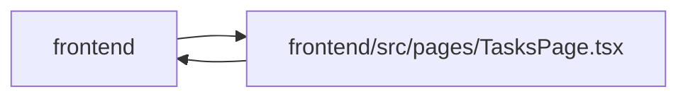

# TasksPage Module

**Path:** `frontend/src/pages/TasksPage.tsx`

## Description

_Auto-generated from `frontend/src/pages/TasksPage.tsx`._

## Imports

| Source | Symbols |
|--------|---------|
| `../components/common/Button` | `Button` |
| `../components/common/FullscreenWorkspace` | `FullscreenWorkspace` |
| `../components/feedback/QueryState` | `QueryErrorState`, `QueryLoadingState` |
| `../components/iteration/IterationSelector` | `IterationSelector` |
| `../components/overview/OverviewTaskReturnBar` | `OverviewTaskReturnBar` |
| `../components/planning/PlanReturnBar` | `PlanReturnBar` |
| `../components/tasks/GuardedTaskModal` | `GuardedTaskModal` |
| `../components/tasks/ImportTasksModal` | `ImportTasksModal` |
| `../components/tasks/KanbanBoard/KanbanBoard` | `KanbanBoard` |
| `../components/tasks/SavedViewsControl` | `SavedViewsControl` |
| `../components/tasks/TaskEditorDrawer` | `TaskEditorDrawer` |
| `../components/tasks/TaskFiltersBar` | `TaskFiltersBar`, `TaskFilters` |
| `../components/tasks/TaskList` | `TaskList`, `SortKey`, `TaskMode` |
| `../components/ui` | `OverflowMenu`, `PageHeader`, `PageLayout`, `SlideOverDrawer` |
| `../features/overview/overviewTaskThread` | `OVERVIEW_TASK_ORIGIN`, `OVERVIEW_TASK_ORIGIN_PARAM`, `OVERVIEW_TASK_PARAM`, `OVERVIEW_TASK_RETURN_PARAM`, `OVERVIEW_TASK_THREAD_PARAM`, `overviewTaskThreadSource`, `positiveTaskId` |
| `../features/planningMasters/planningTaskIssues` | `PLANNING_ITERATION_PARAM`, `PLANNING_TASK_ISSUE_PARAM`, `parsePlanningIterationId`, `parsePlanningTaskIssue`, `PlanningTaskIssue` |
| `../i18n/seedDisplay` | `savedViewDisplay` |
| `../services/iterationService` | `iterationService` |
| `../services/savedViewService` | `savedViewService` |
| `../services/taskService` | `taskService` |
| `../store/iterationStore` | `useIterationStore` |
| `../types/savedView` | `SavedView` |
| `../utils/taskFilterDefaults` | `defaultFilters` |
| `@tanstack/react-query` | `useQuery` |
| `clsx` | `clsx` |
| `framer-motion` | `motion` |
| `lucide-react` | `AlertTriangle`, `Bookmark`, `LayoutGrid`, `List`, `ListFilter`, `Maximize2`, `Minimize2`, `Plus`, `Upload`, `Waypoints`, `X` |
| `react` | `useCallback`, `useEffect`, `useMemo`, `useRef`, `useState` |
| `react-i18next` | `useTranslation` |
| `react-router-dom` | `Link`, `useSearchParams` |

## Module Signals

| Signal | Values |
|--------|--------|
| Exports | `default` |
| Constants | `SORT_KEYS`, `PLANNING_ISSUE_COPY_KEYS` |

## Local dependency map

<!-- Auto-generated local dependency summary. Do not edit by hand. -->

> Module-level dependencies exceed the generated-diagram limits, so the diagram and table below group them by top-level package. Counts report the number of module neighbors in each package.

### Internal neighbors

| Direction | Module |
|---|---|
| Inbound | `frontend` (1) |
| Outbound | `frontend` (23) |

### External packages

| Language | Used packages | Undeclared packages |
|---|---:|---:|
| typescript | 7 | 0 |

> All 24 module neighbor(s) are summarized by package because the module-level view exceeds the 12-node limit.

## Classes

| Class | Kind | Line | Bases / Target | Description |
|-------|------|------|----------------|-------------|
| [ViewMode](../entities/ViewMode.md) | Type alias | 62 | — | — |
