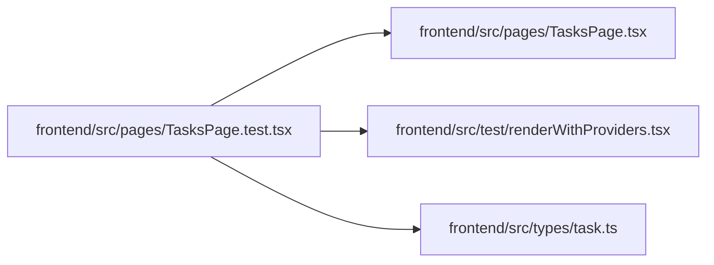

# TasksPage.test Module

**Path:** `frontend/src/pages/TasksPage.test.tsx`

## Description

_Auto-generated from `frontend/src/pages/TasksPage.test.tsx`._

## Imports

| Source | Symbols |
|--------|---------|
| `../test/renderWithProviders` | `renderWithProviders` |
| `../types/task` | `Task` |
| `./TasksPage` | `TasksPage` |
| `@testing-library/react` | `screen`, `waitFor`, `within` |
| `react` | `ReactNode` |
| `react-router-dom` | `useLocation` |
| `vitest` | `beforeEach`, `describe`, `expect`, `it`, `vi` |

## Module Signals

| Signal | Values |
|--------|--------|
| Constants | `iterationServiceMock`, `iterationStoreMock`, `savedViewServiceMock`, `taskServiceMock`, `focusedTask` |
| Module calls | `iterationServiceMock = hoisted`, `iterationStoreMock = hoisted`, `savedViewServiceMock = hoisted`, `taskServiceMock = hoisted`, `mock`, `mock`, `mock`, `mock`, `mock`, `mock`, `mock`, `mock`, `mock`, `mock`, `mock`, `describe` |

## Local dependency map

<!-- Auto-generated local dependency summary. Do not edit by hand. -->

### Internal neighbors

| Direction | Module |
|---|---|
| Outbound | [TasksPage](../modules/TasksPage.md) |
| Outbound | [renderWithProviders](../modules/renderWithProviders.md) |
| Outbound | [types_task](../modules/types_task.md) |

### External packages

| Language | Used packages | Undeclared packages |
|---|---:|---:|
| typescript | 4 | 0 |
