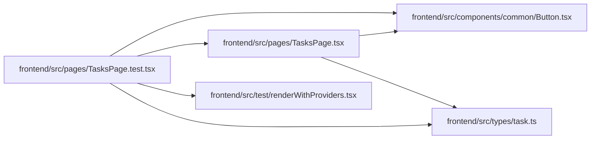

# TasksPage.test Module

**Path:** `frontend/src/pages/TasksPage.test.tsx`

## Description

_Auto-generated from `frontend/src/pages/TasksPage.test.tsx`._

## Imports

| Source | Symbols | Type-only | Runtime emission |
|--------|---------|-----------|------------------|
| `../components/common/Button` | `Button` | — | compiler-dependent |
| `../test/renderWithProviders` | `renderWithProviders` | — | compiler-dependent |
| `../types/task` | `Task` | Declaration | erased |
| `./TasksPage` | `TasksPage` | — | compiler-dependent |
| `@testing-library/react` | `screen`, `waitFor`, `within` | — | compiler-dependent |
| `react` | `ReactNode` | Declaration | erased |
| `react-router-dom` | `useLocation` | — | compiler-dependent |
| `vitest` | `beforeEach`, `describe`, `expect`, `it`, `vi` | — | compiler-dependent |

## Module Signals

| Signal | Values |
|--------|--------|
| Constants | `iterationServiceMock`, `workScopeMock`, `savedViewServiceMock`, `taskServiceMock`, `focusedTask` |
| Module calls | `iterationServiceMock = hoisted`, `workScopeMock = hoisted`, `savedViewServiceMock = hoisted`, `taskServiceMock = hoisted`, `mock`, `mock`, `mock`, `mock`, `mock`, `mock`, `mock`, `mock`, `mock`, `mock`, `mock`, `mock`, `describe` |

## Local dependency map

<!-- Auto-generated local dependency summary. Do not edit by hand. -->
This graph shows full source coupling. Type dependencies can be erased; compiler-dependent cycle groups are runtime candidates, not confirmed initialization cycles.

```mermaid
flowchart LR
    n0["frontend/src/components/common/Button.tsx"]
    n1["frontend/src/pages/TasksPage.test.tsx"]
    n2["frontend/src/pages/TasksPage.tsx"]
    n3["frontend/src/test/renderWithProviders.tsx"]
    n4["frontend/src/types/task.ts"]
    n1 --> n0
    n1 --> n2
    n1 --> n3
    n1 --> n4
    n2 --> n0
    n2 --> n4
    click n0 "../modules/Button.md"
    click n1 "../modules/TasksPage.test.md"
    click n2 "../modules/TasksPage.md"
    click n3 "../modules/renderWithProviders.md"
    click n4 "../modules/types_task.md"
```

### Internal neighbors

| Direction | Module |
|---|---|
| Outbound | [Button](../modules/Button.md) |
| Outbound | [TasksPage](../modules/TasksPage.md) |
| Outbound | [renderWithProviders](../modules/renderWithProviders.md) |
| Outbound | [types_task](../modules/types_task.md) |

### External packages

| Language | Used packages | Undeclared packages |
|---|---:|---:|
| typescript | 4 | 0 |
