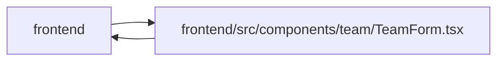

# TeamForm Module

**Path:** `frontend/src/components/team/TeamForm.tsx`

## Description

_Auto-generated from `frontend/src/components/team/TeamForm.tsx`._

## Imports

| Source | Symbols |
|--------|---------|
| `../../services/planningInputService` | `MemberPlanningIntent`, `ObservedRevisions` |
| `../../services/teamService` | `teamService` |
| `../../types/team` | `TeamMember`, `TeamMemberCreate`, `TeamMemberProfile` |
| `../../utils/apiError` | `getApiErrorMessage` |
| `../common/Button` | `Button` |
| `../common/CollapsibleSection` | `CollapsibleSection` |
| `../common/Input` | `Input` |
| `../feedback/QueryState` | `QueryErrorState`, `QueryLoadingState` |
| `../planning/PlanningInputBoundary` | `PlanningInputBoundary` |
| `../tasks/useDraftDismissal` | `useActiveMount` |
| `@tanstack/react-query` | `useMutation`, `useQueryClient`, `useQuery` |
| `lucide-react` | `Save` |
| `react` | `ReactNode`, `useEffect`, `useId`, `useRef`, `useState` |
| `react-i18next` | `useTranslation` |

## Module Signals

| Signal | Values |
|--------|--------|
| Exports | `TeamForm` |

## Local dependency map

<!-- Auto-generated local dependency summary. Do not edit by hand. -->

> Module-level dependencies exceed the generated-diagram limits, so the diagram and table below group them by top-level package. Counts report the number of module neighbors in each package.

### Internal neighbors

| Direction | Module |
|---|---|
| Inbound | `frontend` (2) |
| Outbound | `frontend` (10) |

### External packages

| Language | Used packages | Undeclared packages |
|---|---:|---:|
| typescript | 4 | 0 |

> All 12 module neighbor(s) are summarized by package because the module-level view exceeds the 12-node limit.

## Classes

| Class | Kind | Line | Bases / Target | Description |
|-------|------|------|----------------|-------------|
| [TeamFormProps](../entities/TeamFormProps.md) | Class | 17 | — | — |

## Functions

| Function | Signature | Decorators | Description |
|----------|-----------|------------|-------------|
| `TeamForm` | `(props: TeamFormProps)` | — | — |
