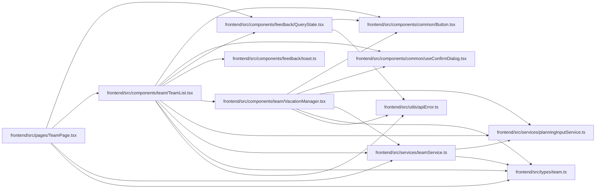

# TeamList Module

**Path:** `frontend/src/components/team/TeamList.tsx`

## Description

_Auto-generated from `frontend/src/components/team/TeamList.tsx`._

## Imports

| Source | Symbols |
|--------|---------|
| `../../services/planningInputService` | `planningInputService`, `ObservedRevisions` |
| `../../services/teamService` | `teamService` |
| `../../types/team` | `MemberCapacity`, `MemberWorkload`, `TeamMember` |
| `../../utils/apiError` | `getApiErrorMessage` |
| `../common/Button` | `Button` |
| `../common/useConfirmDialog` | `useConfirmDialog` |
| `../feedback/QueryState` | `QueryErrorState` |
| `../feedback/toast` | `useToast` |
| `./VacationManager` | `VacationManager` |
| `@tanstack/react-query` | `useQuery`, `useMutation`, `useQueryClient` |
| `lucide-react` | `ChevronDown`, `ChevronUp`, `Loader2`, `Trash2`, `User`, `Plane`, `Calendar` |
| `react` | `useState` |
| `react-i18next` | `useTranslation` |

## Module Signals

| Signal | Values |
|--------|--------|
| Exports | `TeamList` |

## Local dependency map

<!-- Auto-generated local dependency summary. Do not edit by hand. -->

### Internal neighbors

| Direction | Module |
|---|---|
| Inbound | [TeamPage](../modules/TeamPage.md) |
| Outbound | [Button](../modules/Button.md) |
| Outbound | [useConfirmDialog](../modules/useConfirmDialog.md) |
| Outbound | [QueryState](../modules/QueryState.md) |
| Outbound | [toast](../modules/toast.md) |
| Outbound | [VacationManager](../modules/VacationManager.md) |
| Outbound | [planningInputService](../modules/planningInputService.md) |
| Outbound | [teamService](../modules/teamService.md) |
| Outbound | [types_team](../modules/types_team.md) |
| Outbound | [apiError](../modules/apiError.md) |

### External packages

| Language | Used packages | Undeclared packages |
|---|---:|---:|
| typescript | 4 | 0 |

## Classes

| Class | Kind | Line | Bases / Target | Description |
|-------|------|------|----------------|-------------|
| [TeamListProps](../entities/TeamListProps.md) | Class | 15 | — | — |

## Functions

| Function | Signature | Decorators | Description |
|----------|-----------|------------|-------------|
| `TeamList` | `({ iterationId, onEdit }: TeamListProps)` | — | — |
