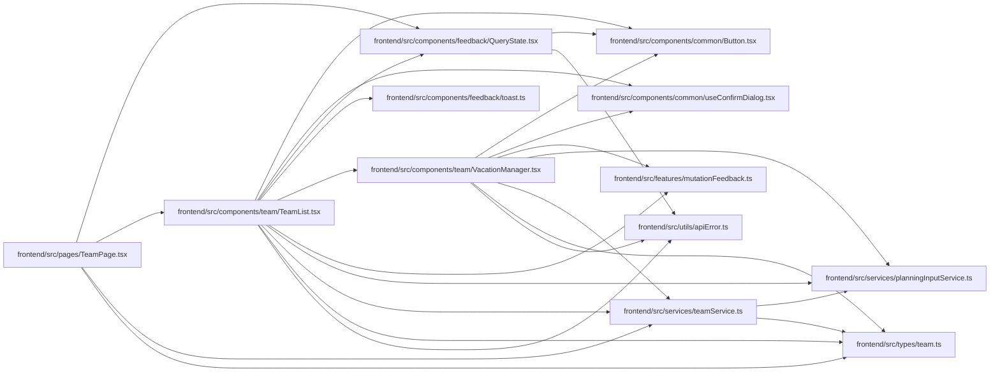

# TeamList Module

**Path:** `frontend/src/components/team/TeamList.tsx`

## Description

_Auto-generated from `frontend/src/components/team/TeamList.tsx`._

## Imports

| Source | Symbols | Type-only | Runtime emission |
|--------|---------|-----------|------------------|
| `../../features/mutationFeedback` | `MutationFeedbackMeta` | Declaration | erased |
| `../../features/mutationFeedback` | `feedbackMessage` | — | compiler-dependent |
| `../../services/planningInputService` | `ObservedRevisions` | Specifier | compiler-dependent |
| `../../services/planningInputService` | `planningInputService` | — | compiler-dependent |
| `../../services/teamService` | `teamService` | — | compiler-dependent |
| `../../types/team` | `MemberCapacity`, `MemberWorkload`, `TeamMember` | Declaration | erased |
| `../../utils/apiError` | `getApiErrorMessage` | — | compiler-dependent |
| `../common/Button` | `Button` | — | compiler-dependent |
| `../common/useConfirmDialog` | `useConfirmDialog` | — | compiler-dependent |
| `../feedback/QueryState` | `QueryErrorState` | — | compiler-dependent |
| `../feedback/toast` | `useToast` | — | compiler-dependent |
| `./VacationManager` | `VacationManager` | — | compiler-dependent |
| `@tanstack/react-query` | `useQuery`, `useMutation`, `useQueryClient` | — | compiler-dependent |
| `lucide-react` | `ChevronDown`, `ChevronUp`, `Loader2`, `Trash2`, `User`, `Plane`, `Calendar` | — | compiler-dependent |
| `react` | `useState` | — | compiler-dependent |
| `react-i18next` | `useTranslation` | — | compiler-dependent |

## Module Signals

| Signal | Values |
|--------|--------|
| Exports | `TeamList` |

## Local dependency map

<!-- Auto-generated local dependency summary. Do not edit by hand. -->
This graph shows full source coupling. Type dependencies can be erased; compiler-dependent cycle groups are runtime candidates, not confirmed initialization cycles.

```mermaid
flowchart LR
    n0["frontend/src/components/common/Button.tsx"]
    n1["frontend/src/components/common/useConfirmDialog.tsx"]
    n2["frontend/src/components/feedback/QueryState.tsx"]
    n3["frontend/src/components/feedback/toast.ts"]
    n4["frontend/src/components/team/TeamList.tsx"]
    n5["frontend/src/components/team/VacationManager.tsx"]
    n6["frontend/src/features/mutationFeedback.ts"]
    n7["frontend/src/pages/TeamPage.tsx"]
    n8["frontend/src/services/planningInputService.ts"]
    n9["frontend/src/services/teamService.ts"]
    n10["frontend/src/types/team.ts"]
    n11["frontend/src/utils/apiError.ts"]
    n2 --> n0
    n2 --> n11
    n4 --> n0
    n4 --> n1
    n4 --> n2
    n4 --> n3
    n4 --> n5
    n4 --> n6
    n4 --> n8
    n4 --> n9
    n4 --> n10
    n4 --> n11
    n5 --> n0
    n5 --> n1
    n5 --> n6
    n5 --> n8
    n5 --> n9
    n5 --> n10
    n5 --> n11
    n7 --> n2
    n7 --> n4
    n7 --> n9
    n7 --> n10
    n9 --> n8
    n9 --> n10
    click n0 "../modules/Button.md"
    click n1 "../modules/useConfirmDialog.md"
    click n2 "../modules/QueryState.md"
    click n3 "../modules/toast.md"
    click n4 "../modules/TeamList.md"
    click n5 "../modules/VacationManager.md"
    click n6 "../modules/mutationFeedback.md"
    click n7 "../modules/TeamPage.md"
    click n8 "../modules/planningInputService.md"
    click n9 "../modules/teamService.md"
    click n10 "../modules/types_team.md"
    click n11 "../modules/apiError.md"
```

### Internal neighbors

| Direction | Module |
|---|---|
| Inbound | [TeamPage](../modules/TeamPage.md) |
| Outbound | [Button](../modules/Button.md) |
| Outbound | [useConfirmDialog](../modules/useConfirmDialog.md) |
| Outbound | [QueryState](../modules/QueryState.md) |
| Outbound | [toast](../modules/toast.md) |
| Outbound | [VacationManager](../modules/VacationManager.md) |
| Outbound | [mutationFeedback](../modules/mutationFeedback.md) |
| Outbound | [planningInputService](../modules/planningInputService.md) |
| Outbound | [teamService](../modules/teamService.md) |
| Outbound | [types_team](../modules/types_team.md) |
| Outbound | [apiError](../modules/apiError.md) |

### External packages

| Language | Used packages | Undeclared packages |
|---|---:|---:|
| typescript | 4 | 0 |

## Classes

| Class | Kind | Line | Bases / Target | Description |
|-------|------|------|----------------|-------------|
| [TeamListProps](../entities/TeamListProps.md) | Interface | 17 | — | — |

## Functions

| Function | Signature | Decorators | Description |
|----------|-----------|------------|-------------|
| `TeamList` | `({ iterationId, onEdit }: TeamListProps)` | — | — |
