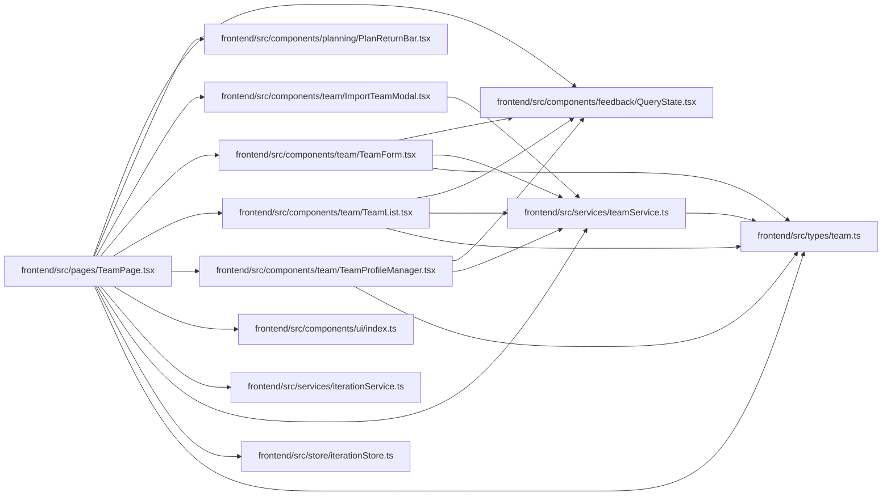

# TeamPage Module

**Path:** `frontend/src/pages/TeamPage.tsx`

## Description

_Auto-generated from `frontend/src/pages/TeamPage.tsx`._

## Imports

| Source | Symbols |
|--------|---------|
| `../components/feedback/QueryState` | `QueryErrorState`, `QueryLoadingState` |
| `../components/planning/PlanReturnBar` | `PlanReturnBar` |
| `../components/team/ImportTeamModal` | `ImportTeamModal` |
| `../components/team/TeamForm` | `TeamForm` |
| `../components/team/TeamList` | `TeamList` |
| `../components/team/TeamProfileManager` | `TeamProfileManager` |
| `../components/ui` | `PageHeader`, `PageLayout` |
| `../services/iterationService` | `iterationService` |
| `../services/teamService` | `teamService` |
| `../store/iterationStore` | `useIterationStore` |
| `../types/team` | `TeamMember`, `TeamMemberProfile` |
| `@tanstack/react-query` | `useQuery` |
| `react` | `useState`, `useEffect` |
| `react-i18next` | `useTranslation` |
| `react-router-dom` | `useSearchParams` |

## Module Signals

| Signal | Values |
|--------|--------|
| Exports | `default` |

## Local dependency map

<!-- Auto-generated local dependency summary. Do not edit by hand. -->

### Internal neighbors

| Direction | Module |
|---|---|
| Outbound | [QueryState](../modules/QueryState.md) |
| Outbound | [PlanReturnBar](../modules/PlanReturnBar.md) |
| Outbound | [ImportTeamModal](../modules/ImportTeamModal.md) |
| Outbound | [TeamForm](../modules/TeamForm.md) |
| Outbound | [TeamList](../modules/TeamList.md) |
| Outbound | [TeamProfileManager](../modules/TeamProfileManager.md) |
| Outbound | [index](../modules/index.md) |
| Outbound | [iterationService](../modules/iterationService.md) |
| Outbound | [teamService](../modules/teamService.md) |
| Outbound | [iterationStore](../modules/iterationStore.md) |
| Outbound | [types_team](../modules/types_team.md) |

### External packages

| Language | Used packages | Undeclared packages |
|---|---:|---:|
| typescript | 4 | 0 |

## Classes

| Class | Kind | Line | Bases / Target | Description |
|-------|------|------|----------------|-------------|
| [TeamPageAction](../entities/TeamPageAction.md) | Type alias | 17 | — | — |
