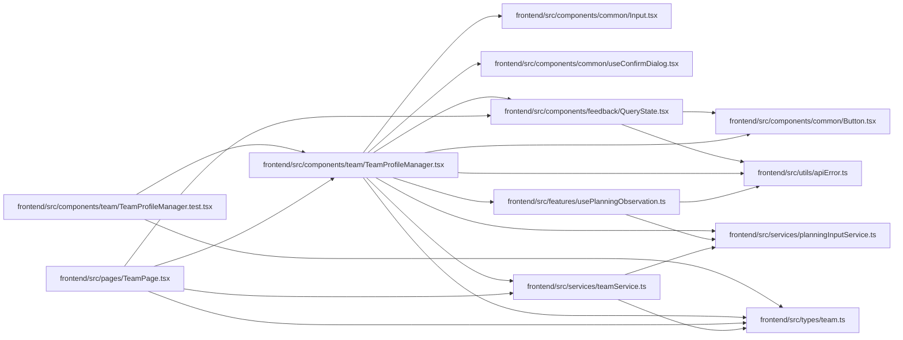

# TeamProfileManager Module

**Path:** `frontend/src/components/team/TeamProfileManager.tsx`

## Description

Profile and skill writes send the original complete observed revisions. Deletion confirmations capture independent immutable observations, and conflicts preserve input for explicit reapply. Skill drafts prevent selection from moving their owning profile.

## Imports

| Source | Symbols |
|--------|---------|
| `../../features/usePlanningObservation` | `usePlanningObservation` |
| `../../services/planningInputService` | `planningInputService` |
| `../../services/teamService` | `teamService` |
| `../../types/team` | `TeamMemberAssignmentMode`, `TeamMemberProfile`, `TeamMemberProfileCreate`, `TeamMemberProfileKind`, `TeamMemberProfileSkill`, `TeamMemberProfileSkillCreate`, `TeamMemberProfileUpdate` |
| `../../utils/apiError` | `getApiErrorMessage` |
| `../common/Button` | `Button` |
| `../common/Input` | `Input` |
| `../common/useConfirmDialog` | `useConfirmDialog` |
| `../feedback/QueryState` | `QueryErrorState`, `QueryLoadingState` |
| `@tanstack/react-query` | `useMutation`, `useQuery`, `useQueryClient` |
| `lucide-react` | `Plus`, `Trash2` |
| `react` | `useEffect`, `useMemo`, `useState` |
| `react-i18next` | `useTranslation` |

## Module Signals

| Signal | Values |
|--------|--------|
| Exports | `TeamProfileManager` |
| Constants | `PROFILE_KINDS`, `ASSIGNMENT_MODES`, `emptyProfileForm`, `emptySkillForm` |

## Local dependency map

<!-- Auto-generated local dependency summary. Do not edit by hand. -->

### Internal neighbors

| Direction | Module |
|---|---|
| Inbound | [TeamProfileManager.test](../modules/TeamProfileManager.test.md) |
| Inbound | [TeamPage](../modules/TeamPage.md) |
| Outbound | [Button](../modules/Button.md) |
| Outbound | [Input](../modules/Input.md) |
| Outbound | [useConfirmDialog](../modules/useConfirmDialog.md) |
| Outbound | [QueryState](../modules/QueryState.md) |
| Outbound | [usePlanningObservation](../modules/usePlanningObservation.md) |
| Outbound | [planningInputService](../modules/planningInputService.md) |
| Outbound | [teamService](../modules/teamService.md) |
| Outbound | [types_team](../modules/types_team.md) |
| Outbound | [apiError](../modules/apiError.md) |

### External packages

| Language | Used packages | Undeclared packages |
|---|---:|---:|
| typescript | 4 | 0 |

## Classes

| Class | Kind | Line | Bases / Target | Description |
|-------|------|------|----------------|-------------|
| [TeamProfileManagerProps](../entities/TeamProfileManagerProps.md) | Class | 66 | — | — |

## Functions

| Function | Signature | Decorators | Description |
|----------|-----------|------------|-------------|
| `TeamProfileManager` | `({     currentIterationId = null,     currentIterationName = null,     assignedProfileIds = [],     onAssignProfile, }: TeamProfileManagerProps)` | — | — |