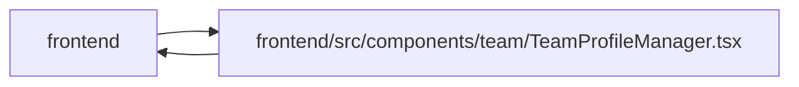

# TeamProfileManager Module

**Path:** `frontend/src/components/team/TeamProfileManager.tsx`

## Description

Profile and skill writes send the original complete observed revisions. Deletion confirmations capture independent immutable observations, and conflicts preserve input for explicit reapply. Skill drafts prevent selection from moving their owning profile. The create-profile and add-capability forms open on request, and the selected profile's detail leads the rail.

## Imports

| Source | Symbols | Type-only | Runtime emission |
|--------|---------|-----------|------------------|
| `../../components/common/Select` | `Select` | — | compiler-dependent |
| `../../features/agentTeamSetup/connectAgent` | `isConnected` | — | compiler-dependent |
| `../../features/agentTeamSetup/useWaitingAgents` | `useWaitingAgents` | — | compiler-dependent |
| `../../features/mutationFeedback` | `MutationFeedbackMeta` | Declaration | erased |
| `../../features/mutationFeedback` | `feedbackMessage` | — | compiler-dependent |
| `../../features/usePlanningObservation` | `usePlanningObservation` | — | compiler-dependent |
| `../../hooks/useAdminAccess` | `useAdminAccess` | — | compiler-dependent |
| `../../services/agentService` | `agentService` | — | compiler-dependent |
| `../../services/planningInputService` | `ObservedPlanningInput` | Specifier | compiler-dependent |
| `../../services/planningInputService` | `planningInputService` | — | compiler-dependent |
| `../../services/teamService` | `teamService` | — | compiler-dependent |
| `../../types/agent` | `AgentActorRosterItem` | Declaration | erased |
| `../../types/team` | `TeamMemberAssignmentMode`, `TeamMemberProfile`, `TeamMemberProfileCreate`, `TeamMemberProfileKind`, `TeamMemberProfileSkill`, `TeamMemberProfileSkillCreate`, `TeamMemberProfileUpdate` | Declaration | erased |
| `../../utils/apiError` | `getApiErrorMessage` | — | compiler-dependent |
| `../../utils/formatDate` | `formatDateTime` | — | compiler-dependent |
| `../common/Button` | `Button` | — | compiler-dependent |
| `../common/Input` | `Input` | — | compiler-dependent |
| `../common/useConfirmDialog` | `useConfirmDialog` | — | compiler-dependent |
| `../feedback/QueryState` | `QueryErrorState` | — | compiler-dependent |
| `../tasks/PersonCapacity` | `PersonCapacity` | — | compiler-dependent |
| `../ui` | `SlideOverDrawer` | — | compiler-dependent |
| `./ConnectionSteps` | `ConnectionSteps` | — | compiler-dependent |
| `./directoryModel` | `AgentStatus`, `DirectoryActor`, `DirectoryRow` | Specifier | compiler-dependent |
| `./directoryModel` | `actorName`, `modelName`, `statusKnown` | — | compiler-dependent |
| `@tanstack/react-query` | `useMutation`, `useQueryClient` | — | compiler-dependent |
| `lucide-react` | `Plus`, `Trash2` | — | compiler-dependent |
| `react` | `RefObject` | Specifier | compiler-dependent |
| `react` | `useCallback`, `useEffect`, `useState` | — | compiler-dependent |
| `react-i18next` | `useTranslation` | — | compiler-dependent |

## Module Signals

| Signal | Values |
|--------|--------|
| Exports | `TeamProfileManager` |
| Constants | `PROFILE_KINDS`, `ASSIGNMENT_MODES`, `emptyProfileForm`, `emptySkillForm`, `MODE_FOR_ROLE` |

## Local dependency map

<!-- Auto-generated local dependency summary. Do not edit by hand. -->
This graph shows full source coupling. Type dependencies can be erased; compiler-dependent cycle groups are runtime candidates, not confirmed initialization cycles.

```mermaid
flowchart LR
    n0["frontend"]
    n1["frontend/src/components/team/TeamProfileManager.tsx"]
    n0 --> n1
    n1 --> n0
    click n1 "../modules/TeamProfileManager.md"
```

> Module-level dependencies exceed the generated-diagram limits, so the diagram and table below group them by top-level package. Counts report the number of module neighbors in each package.

### Internal neighbors

| Direction | Module |
|---|---|
| Inbound | `frontend` (2) |
| Outbound | `frontend` (21) |

### External packages

| Language | Used packages | Undeclared packages |
|---|---:|---:|
| typescript | 4 | 0 |

> All 23 module neighbor(s) are summarized by package because the module-level view exceeds the 12-node limit.

## Classes

| Class | Kind | Line | Bases / Target | Description |
|-------|------|------|----------------|-------------|
| [LinkProfileError](../entities/LinkProfileError.md) | Class | 322 | `Error` | — |
| [TeamProfileManagerProps](../entities/TeamProfileManagerProps.md) | Interface | 91 | — | — |
| [FormBase](../entities/FormBase.md) | Interface | 105 | — | The profile as it was observed: the editable values and the revisions they were read at stay together. |
| [ProfileDrawerProps](../entities/ProfileDrawerProps.md) | Interface | 326 | — | — |
| [ObservedProfile](../entities/ObservedProfile.md) | Type alias | 101 | `ObservedPlanningInput<TeamMemberProfile>` | — |
| [ProfileContext](../entities/ProfileContext.md) | Type alias | 102 | `ReturnType<typeof usePlanningObservation<TeamMemberProfile>>` | — |

## Functions

| Function | Signature | Decorators | Description |
|----------|-----------|------------|-------------|
| `TeamProfileManager` | `({ row, ...drawer }: TeamProfileManagerProps)` | — | The drawer for one person or agent: profile, capabilities, default availability and, for an agent, its model. |
