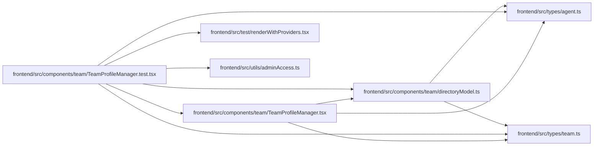

# TeamProfileManager.test Module

**Path:** `frontend/src/components/team/TeamProfileManager.test.tsx`

## Description

_Auto-generated from `frontend/src/components/team/TeamProfileManager.test.tsx`._

## Imports

| Source | Symbols | Type-only | Runtime emission |
|--------|---------|-----------|------------------|
| `../../test/renderWithProviders` | `renderWithProviders` | — | compiler-dependent |
| `../../types/agent` | `AgentActorRosterItem`, `AgentModelBinding`, `AgentTeamMaster`, `AgentTeamMemberSpec`, `AgentTeamMemberStatus`, `AgentTeamStatus` | Declaration | erased |
| `../../types/team` | `TeamMemberProfile`, `TeamMemberProfileCreate`, `TeamMemberProfileUpdate` | Declaration | erased |
| `../../utils/adminAccess` | `clearAdminApiKey`, `setAdminApiKey` | — | compiler-dependent |
| `./TeamProfileManager` | `TeamProfileManager` | — | compiler-dependent |
| `./directoryModel` | `DirectoryRow` | Specifier | compiler-dependent |
| `./directoryModel` | `buildDirectory` | — | compiler-dependent |
| `@testing-library/react` | `screen`, `waitFor`, `within` | — | compiler-dependent |
| `node:crypto` | `createHash` | — | compiler-dependent |
| `vitest` | `afterEach`, `beforeEach`, `describe`, `expect`, `it`, `vi` | — | compiler-dependent |

## Module Signals

| Signal | Values |
|--------|--------|
| Constants | `teamServiceMock`, `planningMock`, `agentServiceMock` |
| Module calls | `teamServiceMock = hoisted`, `planningMock = hoisted`, `agentServiceMock = hoisted`, `mock`, `mock`, `mock`, `describe`, `describe`, `describe`, `describe` |

## Local dependency map

<!-- Auto-generated local dependency summary. Do not edit by hand. -->
This graph shows full source coupling. Type dependencies can be erased; compiler-dependent cycle groups are runtime candidates, not confirmed initialization cycles.

```mermaid
flowchart LR
    n0["frontend/src/components/team/directoryModel.ts"]
    n1["frontend/src/components/team/TeamProfileManager.test.tsx"]
    n2["frontend/src/components/team/TeamProfileManager.tsx"]
    n3["frontend/src/test/renderWithProviders.tsx"]
    n4["frontend/src/types/agent.ts"]
    n5["frontend/src/types/team.ts"]
    n6["frontend/src/utils/adminAccess.ts"]
    n0 --> n4
    n0 --> n5
    n1 --> n0
    n1 --> n2
    n1 --> n3
    n1 --> n4
    n1 --> n5
    n1 --> n6
    n2 --> n0
    n2 --> n4
    n2 --> n5
    click n0 "../modules/directoryModel.md"
    click n1 "../modules/TeamProfileManager.test.md"
    click n2 "../modules/TeamProfileManager.md"
    click n3 "../modules/renderWithProviders.md"
    click n4 "../modules/types_agent.md"
    click n5 "../modules/types_team.md"
    click n6 "../modules/adminAccess.md"
```

### Internal neighbors

| Direction | Module |
|---|---|
| Outbound | [directoryModel](../modules/directoryModel.md) |
| Outbound | [TeamProfileManager](../modules/TeamProfileManager.md) |
| Outbound | [renderWithProviders](../modules/renderWithProviders.md) |
| Outbound | [types_agent](../modules/types_agent.md) |
| Outbound | [types_team](../modules/types_team.md) |
| Outbound | [adminAccess](../modules/adminAccess.md) |

### External packages

| Language | Used packages | Undeclared packages |
|---|---:|---:|
| typescript | 2 | 0 |
