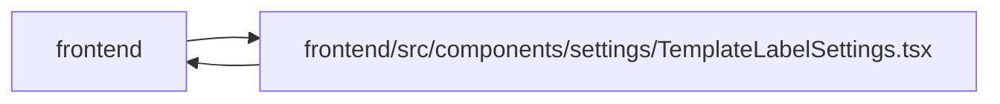

# TemplateLabelSettings Module

**Path:** `frontend/src/components/settings/TemplateLabelSettings.tsx`

## Description

_Auto-generated from `frontend/src/components/settings/TemplateLabelSettings.tsx`._

## Imports

| Source | Symbols |
|--------|---------|
| `../../i18n/seedDisplay` | `labelDisplay`, `labelGroupDisplay`, `templateDisplay` |
| `../../services/labelService` | `labelService` |
| `../../services/templateService` | `templateService` |
| `../../types/label` | `Label`, `LabelCreate`, `LabelGroup`, `LabelGroupCreate`, `LabelGroupUpdate`, `LabelUpdate` |
| `../../types/template` | `TemplateType`, `WorkTemplate`, `WorkTemplateCreate`, `WorkTemplateUpdate` |
| `../../utils/apiError` | `getApiErrorMessage` |
| `../common/Button` | `Button` |
| `../common/Input` | `Input`, `RequiredIndicator` |
| `../feedback/QueryState` | `QueryEmptyState`, `QueryErrorState`, `QueryLoadingState` |
| `../feedback/toast` | `useToast` |
| `../labels/LabelSelector` | `LabelSelector` |
| `@dnd-kit/core` | `DndContext`, `KeyboardSensor`, `PointerSensor`, `closestCenter`, `useSensor`, `useSensors`, `DragEndEvent` |
| `@dnd-kit/sortable` | `SortableContext`, `arrayMove`, `sortableKeyboardCoordinates`, `useSortable`, `verticalListSortingStrategy` |
| `@dnd-kit/utilities` | `CSS` |
| `@tanstack/react-query` | `useMutation`, `useQuery`, `useQueryClient` |
| `lucide-react` | `Archive`, `ChevronDown`, `ChevronUp`, `Edit3`, `FileText`, `GripVertical`, `Plus`, `Power`, `Save`, `Tags`, `X` |
| `react` | `useId`, `useMemo`, `useRef`, `useState` |
| `react-i18next` | `useTranslation` |

## Module Signals

| Signal | Values |
|--------|--------|
| Exports | `TemplateLabelSettings` |
| Constants | `templateTypes` |

## Local dependency map

<!-- Auto-generated local dependency summary. Do not edit by hand. -->

> Module-level dependencies exceed the generated-diagram limits, so the diagram and table below group them by top-level package. Counts report the number of module neighbors in each package.

### Internal neighbors

| Direction | Module |
|---|---|
| Inbound | `frontend` (2) |
| Outbound | `frontend` (11) |

### External packages

| Language | Used packages | Undeclared packages |
|---|---:|---:|
| typescript | 7 | 0 |

> All 13 module neighbor(s) are summarized by package because the module-level view exceeds the 12-node limit.

## Classes

| Class | Kind | Line | Bases / Target | Description |
|-------|------|------|----------------|-------------|
| [TemplateFormState](../entities/TemplateFormState.md) | Class | 47 | — | — |
| [LabelGroupFormState](../entities/LabelGroupFormState.md) | Class | 62 | — | — |
| [LabelFormState](../entities/LabelFormState.md) | Class | 71 | — | — |
| [SortableTemplateRowProps](../entities/SortableTemplateRowProps.md) | Class | 230 | — | — |
| [ManagementSection](../entities/ManagementSection.md) | Type alias | 46 | — | — |

## Functions

| Function | Signature | Decorators | Description |
|----------|-----------|------------|-------------|
| `TemplateLabelSettings` | `()` | — | — |
