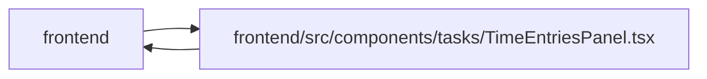

# TimeEntriesPanel Module

**Path:** `frontend/src/components/tasks/TimeEntriesPanel.tsx`

## Description

_Auto-generated from `frontend/src/components/tasks/TimeEntriesPanel.tsx`._

The optional task/project disclosure retains scoped personal drafts and creation UUIDs across failures. Entry corrections require an explicit current-version choice after conflicts. A separate HTML form owns the auxiliary controls, so native time requirements never block the parent task form. Parent or standalone draft guards protect navigation, pending commands and sign-out; private rows/history are hidden on authority failures. Capability-disabled controls disappear, and bounded cursor metadata is validated before continuation.

## Imports

| Source | Symbols |
|--------|---------|
| `../../features/timeEntries/useTimeEntries` | `useTimeEntries` |
| `../../services/taskService` | `taskService` |
| `../../services/timeEntryService` | `timeEntryService`, `timeAccessDenied`, `TimeEntry` |
| `../../utils/apiError` | `getApiErrorMessage` |
| `../../utils/formatDate` | `formatDate` |
| `../common/Button` | `Button` |
| `../common/CollapsibleSection` | `CollapsibleSection` |
| `../common/Input` | `Input` |
| `../feedback/QueryState` | `QueryErrorState` |
| `./DraftDismissalDialog` | `DraftDismissalDialog` |
| `./useDraftDismissal` | `useDraftDismissal` |
| `@tanstack/react-query` | `useInfiniteQuery`, `useMutation`, `useQuery`, `useQueryClient` |
| `date-fns` | `format` |
| `react` | `useCallback`, `useEffect`, `useId`, `useState`, `KeyboardEvent` |
| `react-dom` | `createPortal` |
| `react-i18next` | `useTranslation` |

## Module Signals

| Signal | Values |
|--------|--------|
| Exports | `TimeEntriesPanel` |

## Local dependency map

<!-- Auto-generated local dependency summary. Do not edit by hand. -->

> Module-level dependencies exceed the generated-diagram limits, so the diagram and table below group them by top-level package. Counts report the number of module neighbors in each package.

### Internal neighbors

| Direction | Module |
|---|---|
| Inbound | `frontend` (3) |
| Outbound | `frontend` (11) |

### External packages

| Language | Used packages | Undeclared packages |
|---|---:|---:|
| typescript | 5 | 0 |

> All 14 module neighbor(s) are summarized by package because the module-level view exceeds the 12-node limit.

## Classes

| Class | Kind | Line | Bases / Target | Description |
|-------|------|------|----------------|-------------|
| [Draft](../entities/Draft.md) | Type alias | 20 | — | — |

## Functions

| Function | Signature | Decorators | Description |
|----------|-----------|------------|-------------|
| `TimeEntriesPanel` | `(props: { projectId: number; taskId?: number; disabled?: boolean;     start?: string; end?: string; embedded?: boolean; draftKey?: string \| null; onDirty?: (dirty: boolean) => void; onPending?: (pending: boolean) => void })` | — | — |
