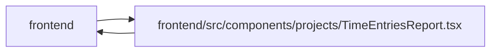

# TimeEntriesReport Module

**Path:** `frontend/src/components/projects/TimeEntriesReport.tsx`

## Description

_Auto-generated from `frontend/src/components/projects/TimeEntriesReport.tsx`._

Project reports expose work-date filters, own versus authorized manager totals, recorded coverage and current hour estimates. Unknown values remain distinct from zero. Personal entry controls inherit the same date range; exported totals never reveal another author's notes. Capability, read and export failures provide localized recovery and withhold cached private contents. Existing design primitives and responsive grids preserve the task/project interface.

## Imports

| Source | Symbols |
|--------|---------|
| `../../components/feedback/LiveWindowStatus` | `LiveWindowStatus` |
| `../../features/timeEntries/useTimeEntries` | `useTimeEntries` |
| `../../features/useLiveWindow` | `useLiveWindow` |
| `../../services/timeEntryService` | `timeEntryService`, `timeAccessDenied` |
| `../../utils/apiError` | `getApiErrorMessage` |
| `../common/Button` | `Button` |
| `../common/CollapsibleSection` | `CollapsibleSection` |
| `../common/Input` | `Input` |
| `../feedback/QueryState` | `QueryErrorState` |
| `../tasks/TimeEntriesPanel` | `TimeEntriesPanel` |
| `@tanstack/react-query` | `useMutation` |
| `date-fns` | `format`, `startOfMonth` |
| `react` | `useState` |
| `react-i18next` | `useTranslation` |

## Module Signals

| Signal | Values |
|--------|--------|
| Exports | `TimeEntriesReport` |

## Local dependency map

<!-- Auto-generated local dependency summary. Do not edit by hand. -->

> Module-level dependencies exceed the generated-diagram limits, so the diagram and table below group them by top-level package. Counts report the number of module neighbors in each package.

### Internal neighbors

| Direction | Module |
|---|---|
| Inbound | `frontend` (2) |
| Outbound | `frontend` (10) |

### External packages

| Language | Used packages | Undeclared packages |
|---|---:|---:|
| typescript | 4 | 0 |

> All 12 module neighbor(s) are summarized by package because the module-level view exceeds the 12-node limit.

## Functions

| Function | Signature | Decorators | Description |
|----------|-----------|------------|-------------|
| `TimeEntriesReport` | `({ projectId }: { projectId: number })` | — | — |