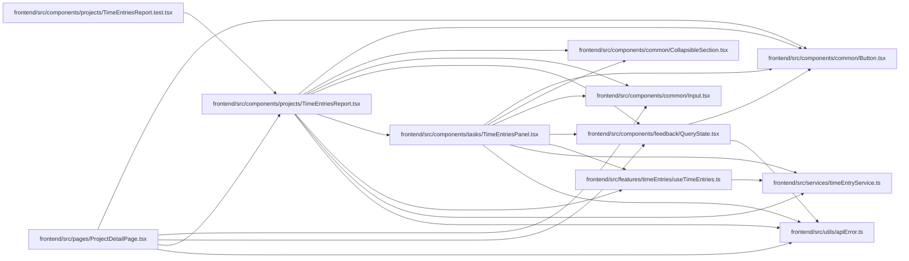

# TimeEntriesReport Module

**Path:** `frontend/src/components/projects/TimeEntriesReport.tsx`

## Description

_Auto-generated from `frontend/src/components/projects/TimeEntriesReport.tsx`._

Project reports expose work-date filters, own versus authorized manager totals, recorded coverage and current hour estimates. Unknown values remain distinct from zero. Personal entry controls inherit the same date range; exported totals never reveal another author's notes. Capability, read and export failures provide localized recovery and withhold cached private contents. Existing design primitives and responsive grids preserve the task/project interface.

## Imports

| Source | Symbols |
|--------|---------|
| `../../features/timeEntries/useTimeEntries` | `useTimeEntries` |
| `../../services/timeEntryService` | `timeEntryService`, `timeAccessDenied` |
| `../../utils/apiError` | `getApiErrorMessage` |
| `../common/Button` | `Button` |
| `../common/CollapsibleSection` | `CollapsibleSection` |
| `../common/Input` | `Input` |
| `../feedback/QueryState` | `QueryErrorState` |
| `../tasks/TimeEntriesPanel` | `TimeEntriesPanel` |
| `@tanstack/react-query` | `useInfiniteQuery`, `useMutation` |
| `date-fns` | `format`, `startOfMonth` |
| `react` | `useState` |
| `react-i18next` | `useTranslation` |

## Module Signals

| Signal | Values |
|--------|--------|
| Exports | `TimeEntriesReport` |

## Local dependency map

<!-- Auto-generated local dependency summary. Do not edit by hand. -->

### Internal neighbors

| Direction | Module |
|---|---|
| Inbound | [TimeEntriesReport.test](../modules/TimeEntriesReport.test.md) |
| Inbound | [ProjectDetailPage](../modules/ProjectDetailPage.md) |
| Outbound | [Button](../modules/Button.md) |
| Outbound | [CollapsibleSection](../modules/CollapsibleSection.md) |
| Outbound | [Input](../modules/Input.md) |
| Outbound | [QueryState](../modules/QueryState.md) |
| Outbound | [TimeEntriesPanel](../modules/TimeEntriesPanel.md) |
| Outbound | [useTimeEntries](../modules/useTimeEntries.md) |
| Outbound | [timeEntryService](../modules/timeEntryService.md) |
| Outbound | [apiError](../modules/apiError.md) |

### External packages

| Language | Used packages | Undeclared packages |
|---|---:|---:|
| typescript | 4 | 0 |

## Functions

| Function | Signature | Decorators | Description |
|----------|-----------|------------|-------------|
| `TimeEntriesReport` | `({ projectId }: { projectId: number })` | — | — |
