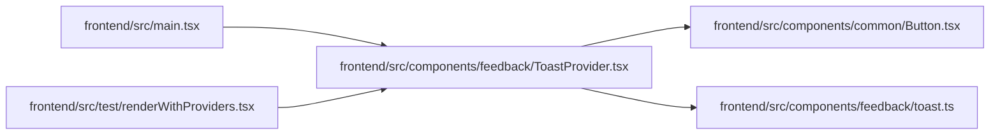

# ToastProvider Module

**Path:** `frontend/src/components/feedback/ToastProvider.tsx`

## Description

_Auto-generated from `frontend/src/components/feedback/ToastProvider.tsx`._

## Imports

| Source | Symbols |
|--------|---------|
| `../common/Button` | `Button` |
| `./toast` | `ToastContext`, `ToastApi`, `ToastInput`, `ToastTone` |
| `lucide-react` | `AlertTriangle`, `CheckCircle2`, `Info`, `X` |
| `react` | `useCallback`, `useEffect`, `useMemo`, `useState`, `ReactNode` |
| `react-i18next` | `useTranslation` |

## Module Signals

| Signal | Values |
|--------|--------|
| Exports | `ToastProvider` |
| Constants | `toastClasses`, `toastIcons`, `iconClasses` |

## Local dependency map

<!-- Auto-generated local dependency summary. Do not edit by hand. -->

### Internal neighbors

| Direction | Module |
|---|---|
| Inbound | [src_main](../modules/src_main.md) |
| Inbound | [renderWithProviders](../modules/renderWithProviders.md) |
| Outbound | [Button](../modules/Button.md) |
| Outbound | [toast](../modules/toast.md) |

### External packages

| Language | Used packages | Undeclared packages |
|---|---:|---:|
| typescript | 3 | 0 |

## Classes

| Class | Kind | Line | Bases / Target | Description |
|-------|------|------|----------------|-------------|
| [ToastRecord](../entities/ToastRecord.md) | Class | 13 | `Required` | — |

## Functions

| Function | Signature | Decorators | Description |
|----------|-----------|------------|-------------|
| `ToastProvider` | `({ children }: { children: ReactNode })` | — | — |
