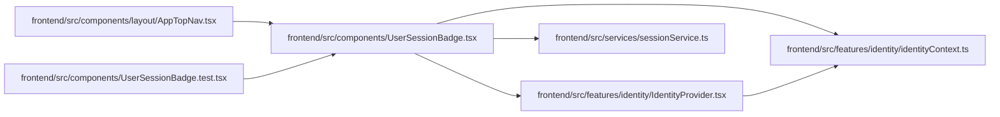

# UserSessionBadge Module

**Path:** `frontend/src/components/UserSessionBadge.tsx`

## Description

_Auto-generated from `frontend/src/components/UserSessionBadge.tsx`._

## Imports

| Source | Symbols |
|--------|---------|
| `../features/identity/IdentityProvider` | `IdentityBadge` |
| `../features/identity/identityContext` | `useIdentity` |
| `../services/sessionService` | `sessionService`, `UserSession` |
| `lucide-react` | `User`, `Loader2` |
| `react` | `useEffect`, `useState` |
| `react-i18next` | `useTranslation` |

## Module Signals

| Signal | Values |
|--------|--------|
| Exports | `UserSessionBadge` |

## Local dependency map

<!-- Auto-generated local dependency summary. Do not edit by hand. -->

### Internal neighbors

| Direction | Module |
|---|---|
| Inbound | [AppTopNav](../modules/AppTopNav.md) |
| Inbound | [UserSessionBadge.test](../modules/UserSessionBadge.test.md) |
| Outbound | [identityContext](../modules/identityContext.md) |
| Outbound | [IdentityProvider](../modules/IdentityProvider.md) |
| Outbound | [sessionService](../modules/sessionService.md) |

### External packages

| Language | Used packages | Undeclared packages |
|---|---:|---:|
| typescript | 3 | 0 |

## Functions

| Function | Signature | Decorators | Description |
|----------|-----------|------------|-------------|
| `UserSessionBadge` | `()` | — | — |
