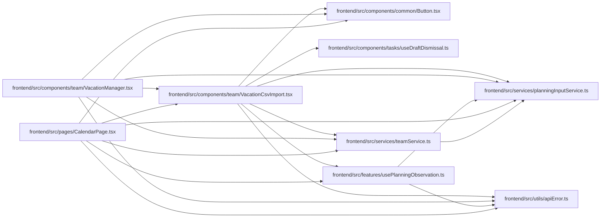

# VacationCsvImport Module

**Path:** `frontend/src/components/team/VacationCsvImport.tsx`

## Description

Vacation CSV selection opens a bounded shared-person scope preview. Import sends the retained file text and map; scope conflicts preserve the preview, and partial-success errors remain visible.

## Imports

| Source | Symbols |
|--------|---------|
| `../../features/usePlanningObservation` | `usePlanningObservation` |
| `../../services/planningInputService` | `ObservedRevisions` |
| `../../services/teamService` | `teamService` |
| `../../utils/apiError` | `getApiErrorMessage` |
| `../common/Button` | `Button` |
| `../tasks/useDraftDismissal` | `useActiveMount` |
| `@tanstack/react-query` | `useMutation` |
| `react` | `useEffect`, `useState` |
| `react-i18next` | `useTranslation` |

## Module Signals

| Signal | Values |
|--------|--------|
| Exports | `VacationCsvImport` |

## Local dependency map

<!-- Auto-generated local dependency summary. Do not edit by hand. -->

### Internal neighbors

| Direction | Module |
|---|---|
| Inbound | [VacationManager](../modules/VacationManager.md) |
| Inbound | [CalendarPage](../modules/CalendarPage.md) |
| Outbound | [Button](../modules/Button.md) |
| Outbound | [useDraftDismissal](../modules/useDraftDismissal.md) |
| Outbound | [usePlanningObservation](../modules/usePlanningObservation.md) |
| Outbound | [planningInputService](../modules/planningInputService.md) |
| Outbound | [teamService](../modules/teamService.md) |
| Outbound | [apiError](../modules/apiError.md) |

### External packages

| Language | Used packages | Undeclared packages |
|---|---:|---:|
| typescript | 3 | 0 |

## Functions

| Function | Signature | Decorators | Description |
|----------|-----------|------------|-------------|
| `VacationCsvImport` | `({ iterationId, onSuccess, onBusyChange }: { iterationId: number; onSuccess: () => void; onBusyChange?: (busy: boolean) => void })` | — | — |
