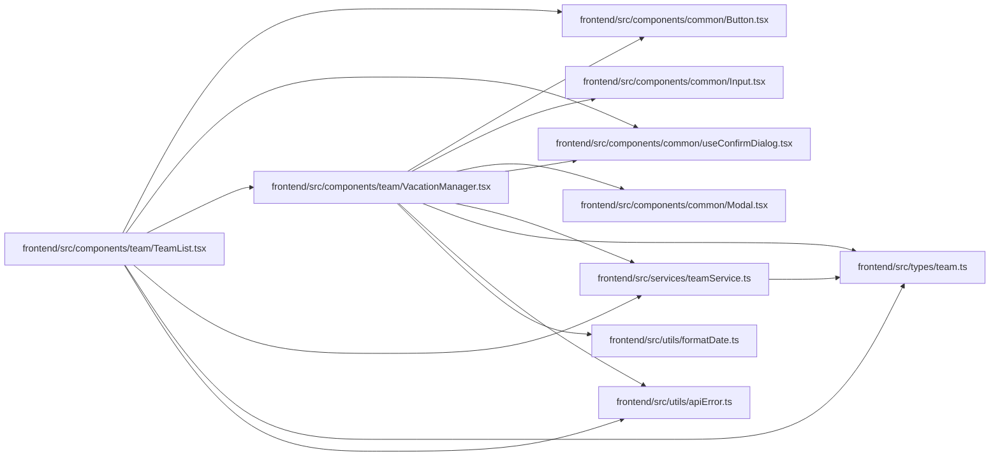

# VacationManager Module

**Path:** `frontend/src/components/team/VacationManager.tsx`

## Description

_Auto-generated from `frontend/src/components/team/VacationManager.tsx`._

## Imports

| Source | Symbols |
|--------|---------|
| `../../services/teamService` | `teamService` |
| `../../types/team` | `Vacation`, `TeamMember` |
| `../../utils/apiError` | `getApiErrorMessage` |
| `../../utils/formatDate` | `formatDate` |
| `../common/Button` | `Button` |
| `../common/Input` | `Input` |
| `../common/Modal` | `Modal` |
| `../common/useConfirmDialog` | `useConfirmDialog` |
| `@tanstack/react-query` | `useMutation`, `useQueryClient` |
| `lucide-react` | `Plane`, `Trash2`, `Plus`, `Calendar`, `Upload` |
| `react` | `useState` |
| `react-i18next` | `useTranslation` |

## Module Signals

| Signal | Values |
|--------|--------|
| Exports | `VacationManager` |

## Local dependency map

<!-- Auto-generated local dependency summary. Do not edit by hand. -->

### Internal neighbors

| Direction | Module |
|---|---|
| Inbound | [TeamList](../modules/TeamList.md) |
| Outbound | [Button](../modules/Button.md) |
| Outbound | [Input](../modules/Input.md) |
| Outbound | [Modal](../modules/Modal.md) |
| Outbound | [useConfirmDialog](../modules/useConfirmDialog.md) |
| Outbound | [teamService](../modules/teamService.md) |
| Outbound | [types_team](../modules/types_team.md) |
| Outbound | [apiError](../modules/apiError.md) |
| Outbound | [formatDate](../modules/formatDate.md) |

### External packages

| Language | Used packages | Undeclared packages |
|---|---:|---:|
| typescript | 4 | 0 |

## Classes

| Class | Kind | Line | Bases / Target | Description |
|-------|------|------|----------------|-------------|
| [VacationManagerProps](../entities/VacationManagerProps.md) | Class | 14 | — | — |

## Functions

| Function | Signature | Decorators | Description |
|----------|-----------|------------|-------------|
| `VacationManager` | `({ member, onClose }: VacationManagerProps)` | — | — |
