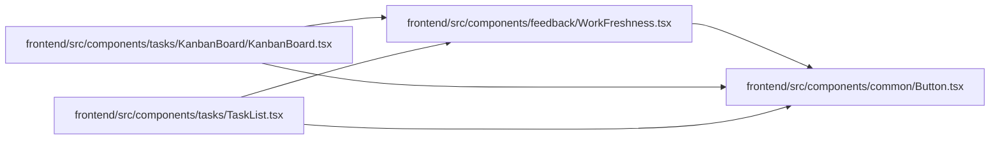

# WorkFreshness Module

**Path:** `frontend/src/components/feedback/WorkFreshness.tsx`

## Description

Displays the update time, unavailable/stale state, and refresh action for a caller-owned work query. Query scheduling and identity cache ownership live in the separate workQueryFreshness and identity modules.

## Imports

| Source | Symbols |
|--------|---------|
| `../common/Button` | `Button` |
| `react-i18next` | `useTranslation` |

## Module Signals

| Signal | Values |
|--------|--------|
| Exports | `WorkFreshness` |

## Local dependency map

<!-- Auto-generated local dependency summary. Do not edit by hand. -->

### Internal neighbors

| Direction | Module |
|---|---|
| Inbound | [KanbanBoard](../modules/KanbanBoard.md) |
| Inbound | [TaskList](../modules/TaskList.md) |
| Outbound | [Button](../modules/Button.md) |

### External packages

| Language | Used packages | Undeclared packages |
|---|---:|---:|
| typescript | 1 | 0 |

## Functions

| Function | Signature | Decorators | Description |
|----------|-----------|------------|-------------|
| `WorkFreshness` | `({ updatedAt, stale, refreshing, onRefresh }: {     updatedAt: number; stale: boolean; refreshing: boolean; onRefresh: () => void; })` | — | Display update age and recovery state for a caller-owned work query. |