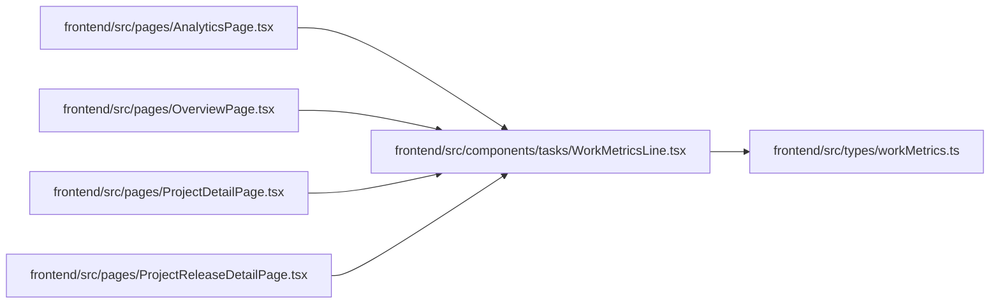

# WorkMetricsLine Module

**Path:** `frontend/src/components/tasks/WorkMetricsLine.tsx`

## Description

_Auto-generated from `frontend/src/components/tasks/WorkMetricsLine.tsx`._

## Imports

| Source | Symbols |
|--------|---------|
| `../../types/workMetrics` | `WorkMetrics` |
| `react-i18next` | `useTranslation` |

## Module Signals

| Signal | Values |
|--------|--------|
| Exports | `WorkMetricsLine` |

## Local dependency map

<!-- Auto-generated local dependency summary. Do not edit by hand. -->

### Internal neighbors

| Direction | Module |
|---|---|
| Inbound | [AnalyticsPage](../modules/AnalyticsPage.md) |
| Inbound | [OverviewPage](../modules/OverviewPage.md) |
| Inbound | [ProjectDetailPage](../modules/ProjectDetailPage.md) |
| Inbound | [ProjectReleaseDetailPage](../modules/ProjectReleaseDetailPage.md) |
| Outbound | [workMetrics](../modules/workMetrics.md) |

### External packages

| Language | Used packages | Undeclared packages |
|---|---:|---:|
| typescript | 1 | 0 |

## Functions

| Function | Signature | Decorators | Description |
|----------|-----------|------------|-------------|
| `WorkMetricsLine` | `({ metrics }: { metrics?: WorkMetrics \| null })` | — | — |
