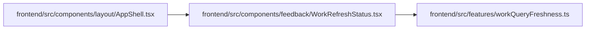

# WorkRefreshStatus Module

**Path:** `frontend/src/components/feedback/WorkRefreshStatus.tsx`

## Description

_Auto-generated from `frontend/src/components/feedback/WorkRefreshStatus.tsx`._

## Imports

| Source | Symbols |
|--------|---------|
| `../../features/workQueryFreshness` | `WORKSPACE_QUERY_POLICIES` |
| `@tanstack/react-query` | `useQueryClient` |
| `react` | `useEffect`, `useReducer`, `useState` |
| `react-i18next` | `useTranslation` |

## Module Signals

| Signal | Values |
|--------|--------|
| Exports | `WorkRefreshStatus` |

## Local dependency map

<!-- Auto-generated local dependency summary. Do not edit by hand. -->

### Internal neighbors

| Direction | Module |
|---|---|
| Inbound | [AppShell](../modules/AppShell.md) |
| Outbound | [workQueryFreshness](../modules/workQueryFreshness.md) |

### External packages

| Language | Used packages | Undeclared packages |
|---|---:|---:|
| typescript | 3 | 0 |

## Functions

| Function | Signature | Decorators | Description |
|----------|-----------|------------|-------------|
| `WorkRefreshStatus` | `()` | — | — |
