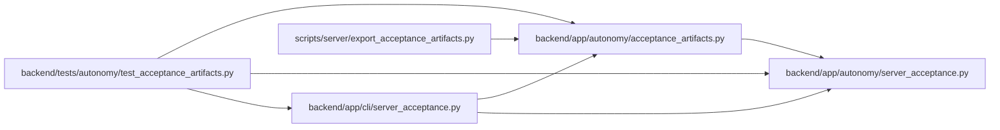

# acceptance_artifacts Module

**Path:** `backend/app/autonomy/acceptance_artifacts.py`

## Description

Stages exact validated receipt bytes and their matching public Ed25519 pins in a new atomic public directory. It retains at most one latest and eight prior receipts, rejects duplicate JSON keys, credential-bearing URLs, non-regular files and oversized inputs, and emits a candidate/checksum index plus a generic failure summary. Export association is not signer trust. Offline archive verification requires an independent pin outside the archive, exact membership/hashes and signed candidate identity; latest receipt validity and baked build identity are enforced, while prior receipts remain archival signature evidence. Failed or incomplete exports cannot become acceptance.

## Imports

| Source | Symbols |
|--------|---------|
| `__future__` | `annotations` |
| `app.autonomy.server_acceptance` | `BlockedServerAcceptance`, `ServerAcceptanceReceipt`, `verify_receipt_current_build`, `verify_receipt_trusted_signer` |
| `base64` | `base64` |
| `hashlib` | `sha256` |
| `json` | `json` |
| `os` | `os` |
| `pathlib` | `Path` |
| `re` | `re` |
| `stat` | `stat` |
| `tempfile` | `tempfile` |
| `urllib.parse` | `urlsplit` |

## Local dependency map

<!-- Auto-generated local dependency summary. Do not edit by hand. -->

### Internal neighbors

| Direction | Module |
|---|---|
| Inbound | [cli_server_acceptance](../modules/cli_server_acceptance.md) |
| Inbound | [test_acceptance_artifacts](../modules/test_acceptance_artifacts.md) |
| Inbound | [export_acceptance_artifacts](../modules/export_acceptance_artifacts.md) |
| Outbound | [autonomy_server_acceptance](../modules/autonomy_server_acceptance.md) |

## Functions

| Function | Signature | Decorators | Description |
|----------|-----------|------------|-------------|
| `_read` | `(path: Path, limit: int) -> bytes` | — | Read only a bounded regular file without following a file symlink. |
| `_public_urls` | `(value)` | — | — |
| `_receipt` | `(payload: bytes)` | — | — |
| `_json` | `(payload: bytes)` | — | — |
| `_pin_name` | `(name: str) -> str` | — | — |
| `_identity` | `(receipt) -> dict` | — | — |
| `_pin` | `(payload: bytes, receipt: ServerAcceptanceReceipt) -> None` | — | — |
| `export_artifacts` | `(source: Path, output: Path, *, outcome: str) -> dict` | — | Stage validated exact bytes; failures export a generic summary, never an accepted decision. |
| `verify_exported_artifacts` | `(directory: Path, trusted_public_key: Path, build) -> dict` | — | Verify exact archive membership, hashes and signatures using a separately supplied trust pin. |
