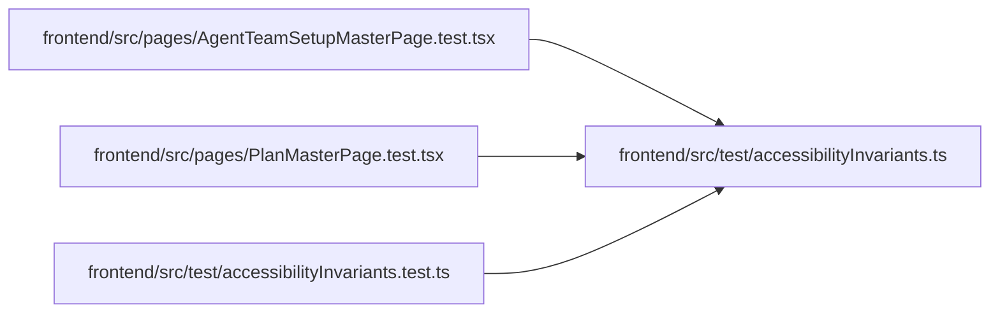

# accessibilityInvariants Module

**Path:** `frontend/src/test/accessibilityInvariants.ts`

## Description

_Auto-generated from `frontend/src/test/accessibilityInvariants.ts`._

## Imports

| Source | Symbols |
|--------|---------|
| `@testing-library/dom` | `getRoles` |
| `dom-accessibility-api` | `computeAccessibleName` |

## Module Signals

| Signal | Values |
|--------|--------|
| Exports | `accessibleNameViolations`, `summaryNameViolations` |
| Constants | `UNIQUE_NAME_ROLES` |

## Local dependency map

<!-- Auto-generated local dependency summary. Do not edit by hand. -->

### Internal neighbors

| Direction | Module |
|---|---|
| Inbound | [AgentTeamSetupMasterPage.test](../modules/AgentTeamSetupMasterPage.test.md) |
| Inbound | [PlanMasterPage.test](../modules/PlanMasterPage.test.md) |
| Inbound | [accessibilityInvariants.test](../modules/accessibilityInvariants.test.md) |

### External packages

| Language | Used packages | Undeclared packages |
|---|---:|---:|
| typescript | 2 | 0 |

## Classes

| Class | Kind | Line | Bases / Target | Description |
|-------|------|------|----------------|-------------|
| [AccessibleNameViolation](../entities/AccessibleNameViolation.md) | Class | 16 | — | — |

## Functions

| Function | Signature | Decorators | Description |
|----------|-----------|------------|-------------|
| `accessibleNameViolations` | `(container: HTMLElement) -> AccessibleNameViolation[]` | — | — |
| `summaryNameViolations` | `(container: HTMLElement) -> string[]` | — | — |
