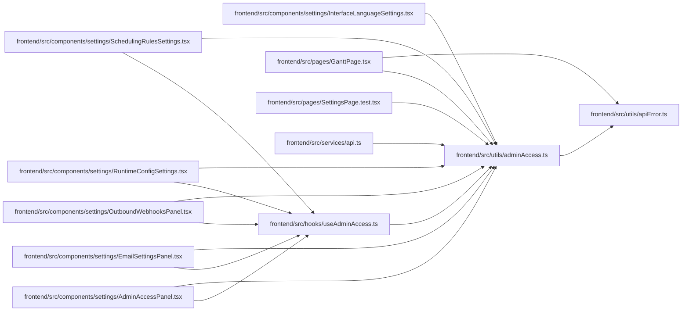

# adminAccess Module

**Path:** `frontend/src/utils/adminAccess.ts`

## Description

_Auto-generated from `frontend/src/utils/adminAccess.ts`._

## Imports

| Source | Symbols |
|--------|---------|
| `./apiError` | `getApiErrorMessage`, `getApiErrorStatus` |

## Module Signals

| Signal | Values |
|--------|--------|
| Exports | `ADMIN_API_KEY_CHANGED_EVENT`, `ADMIN_API_KEY_STORAGE_KEY`, `AdminAccessErrorMessages`, `clearAdminApiKey`, `getAdminAccessErrorMessage`, `getAdminApiKey`, `hasAdminApiKey`, `setAdminApiKey` |
| Constants | `ADMIN_API_KEY_STORAGE_KEY`, `ADMIN_API_KEY_CHANGED_EVENT` |

## Local dependency map

<!-- Auto-generated local dependency summary. Do not edit by hand. -->

### Internal neighbors

| Direction | Module |
|---|---|
| Inbound | [AdminAccessPanel](../modules/AdminAccessPanel.md) |
| Inbound | [EmailSettingsPanel](../modules/EmailSettingsPanel.md) |
| Inbound | [InterfaceLanguageSettings](../modules/InterfaceLanguageSettings.md) |
| Inbound | [OutboundWebhooksPanel](../modules/OutboundWebhooksPanel.md) |
| Inbound | [RuntimeConfigSettings](../modules/RuntimeConfigSettings.md) |
| Inbound | [SchedulingRulesSettings](../modules/SchedulingRulesSettings.md) |
| Inbound | [useAdminAccess](../modules/useAdminAccess.md) |
| Inbound | [GanttPage](../modules/GanttPage.md) |
| Inbound | [SettingsPage.test](../modules/SettingsPage.test.md) |
| Inbound | [api](../modules/api.md) |
| Outbound | [apiError](../modules/apiError.md) |

## Classes

| Class | Kind | Line | Bases / Target | Description |
|-------|------|------|----------------|-------------|
| [AdminAccessErrorMessages](../entities/AdminAccessErrorMessages.md) | Class | 6 | — | — |

## Functions

| Function | Signature | Decorators | Description |
|----------|-----------|------------|-------------|
| `getAdminApiKey` | `()` | — | — |
| `hasAdminApiKey` | `()` | — | — |
| `setAdminApiKey` | `(apiKey: string)` | — | — |
| `clearAdminApiKey` | `()` | — | — |
| `getAdminAccessErrorMessage` | `(error: unknown, messages: AdminAccessErrorMessages)` | — | — |
